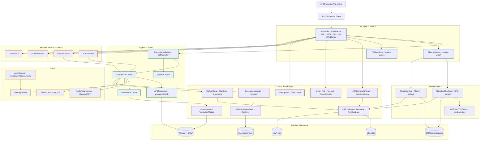
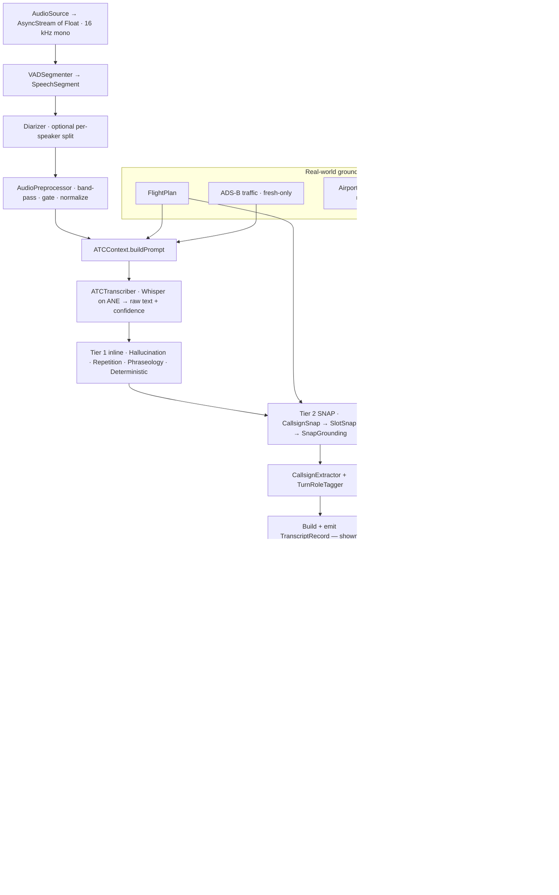
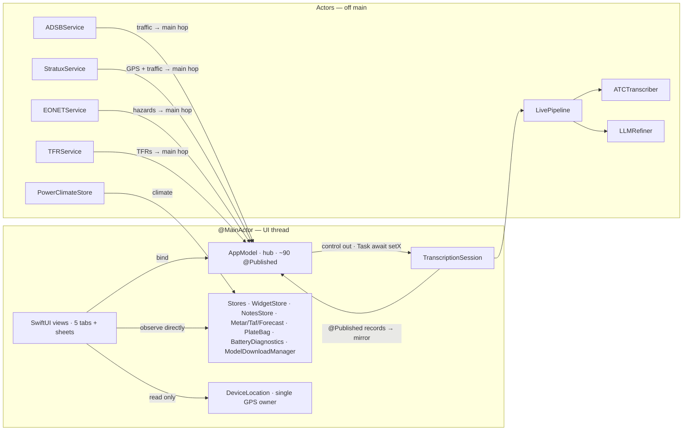

# CommSight — Architecture

> **What this document is.** A complete, human-readable map of how the CommSight
> codebase works, from the moment a radio transmission hits the microphone to the
> corrected, speaker-labelled line on screen and the one-tap flight-plan amendment it
> can trigger. It covers every subsystem, the offline data that powers them, the build
> and ship pipeline, and the design rules that keep it correct. It is written to be read
> top-to-bottom by a new engineer, or dipped into by section.
>
> **Scope & version.** This describes the code on the `experimental/maplibre-migration`
> branch (the `atc-maplibre` worktree), which is what `origin/main` points at and what
> ships today as **TestFlight build 65**. Companion docs: [`ios/README.md`](ios/README.md)
> (what the app is + the Swift↔Python mapping), [`ios/PIPELINES.md`](ios/PIPELINES.md)
> (runtime data-flow for interns), [`ios/REMEDIATION.md`](ios/REMEDIATION.md) (the
> 23-finding reliability audit), and [`python-legacy/README.md`](python-legacy/README.md)
> (the original Python implementation).

---

## Table of contents

1. [What CommSight is](#1-what-commsight-is)
2. [Repository layout](#2-repository-layout)
3. [The big picture](#3-the-big-picture)
4. [End-to-end runtime data flow](#4-end-to-end-runtime-data-flow)
5. [Concurrency & application-state model](#5-concurrency--application-state-model)
6. [Subsystems](#6-subsystems)
   - [6.1 App shell & navigation chrome](#61-app-shell--navigation-chrome)
   - [6.2 Audio capture & DSP](#62-audio-capture--dsp)
   - [6.3 Transcription engine & live pipeline](#63-transcription-engine--live-pipeline)
   - [6.4 Correction, NLP & grounding](#64-correction-nlp--grounding)
   - [6.5 Navigation, procedures, flight plan & the EFB voice interpreter](#65-navigation-procedures-flight-plan--the-efb-voice-interpreter)
   - [6.6 Weather, plate geo-referencing, time & location](#66-weather-plate-geo-referencing-time--location)
   - [6.7 The moving map — two engines & the overlay stack](#67-the-moving-map--two-engines--the-overlay-stack)
   - [6.8 Content tabs & feature sheets](#68-content-tabs--feature-sheets)
   - [6.9 Aircraft/traffic, hazards & downloads](#69-aircrafttraffic-hazards--downloads)
   - [6.10 Diagnostics](#610-diagnostics)
7. [Offline data & bundled assets](#7-offline-data--bundled-assets)
8. [The charts pipeline](#8-the-charts-pipeline)
9. [Build system & shipping](#9-build-system--shipping)
10. [The legacy Python pipeline & parity](#10-the-legacy-python-pipeline--parity)
11. [The Stratux Pi companion](#11-the-stratux-pi-companion)
12. [Design principles & invariants](#12-design-principles--invariants)
13. [Fragile regions](#13-fragile-regions)
14. [Testing strategy](#14-testing-strategy)
15. [Glossary](#15-glossary)

---

## 1. What CommSight is

CommSight is a **native iOS/iPadOS Electronic Flight Bag (EFB) that transcribes live
air-traffic-control radio entirely on the device.** There is no server. From audio
capture through speech recognition, correction, speaker labelling, and the moving-map
cockpit display, every stage runs on the iPhone/iPad. It ships through TestFlight as
**CommSight** (bundle id `com.flycommsight.atctranscribe`), universal binary, iPad-first
cockpit layout, deployment target **iOS 17**.

It does two big things, tightly integrated:

1. **Listens and transcribes.** It takes an audio feed (the aircraft's cockpit radio via
   a Stratux receiver, an internet LiveATC stream, the device mic/USB, or a bundled demo
   clip), detects each transmission, transcribes it with a **fine-tuned Whisper model on
   the Apple Neural Engine**, then runs a **multi-tier correction cascade** that grounds
   the text against real-world aviation data (the airport's actual runways, published
   frequencies, live ADS-B traffic, the filed flight plan). Each line is tagged with its
   callsign and a **speaker label** ("ATC" vs the pilot's callsign).

2. **Acts as a cockpit EFB.** A moving-map home screen renders **offline FAA VFR/IFR
   charts**, airspace, airways, navaids, live traffic, weather, and TFRs, with
   tap-to-identify, search, and on-map route editing. It draws **coded approaches, SIDs
   and STARs** (from a bundled FAA CIFP database) and can load them into the flight plan.
   Crucially, a **voice-driven clearance loader** hears a controller clearance addressed
   to *your own* aircraft ("N8925T, cleared direct BOSOX… cleared ILS runway 4 right") and
   offers a one-tap chip to load it — never firing on another aircraft on frequency.

The guiding constraints throughout the codebase are **offline-first** (it must work in a
cockpit with no cell signal), **battery/thermal frugality** (an always-on map + on-device
ML is a heat budget problem), and **safety-grade conservatism** (a wrong correction or a
mis-fired clearance is worse than none, so most logic fails closed).

---

## 2. Repository layout

The repo holds **two implementations of one pipeline** plus the machinery to build and
ship the app. The Python came first; the Swift app is a faithful, verified port of it.

```
atc-maplibre/                (git worktree of ATC_Transcriptions, branch experimental/maplibre-migration)
├── ios/                     # THE SHIPPED APP (Swift / SwiftUI / WhisperKit / MapLibre)
│   ├── ATCTranscribe/       #   app sources — 144 Swift files, ~33k LOC, 14 groups
│   ├── ATCTranscribeTests/  #   72 XCTest unit-test files
│   ├── ATCTranscribeUITests/#   9 UI-test files
│   ├── ATCKitProbe/         #   headless macOS CLI that runs the engine on the real ANE
│   ├── Tools/               #   ~33 build/data-gen/parity scripts (see §7, §9)
│   ├── Vendor/              #   llama.xcframework (symlinked, git-ignored)
│   ├── project.yml          #   XcodeGen spec — the build source of truth (.xcodeproj is generated)
│   └── README / PIPELINES / REMEDIATION / RECOVERY .md
├── charts/                  # FAA raster charts → WebP MBTiles packs → Hugging Face (GDAL pipeline)
├── python-legacy/           # the original Python server/desktop pipeline + ML training/eval toolbox
└── stratux-pi/              # Raspberry Pi companion: streams cockpit VHF audio to the app
```

> **Worktree note.** `atc-maplibre` is a linked git worktree; its `.git` is a file
> pointing back into the primary `ATC_Transcriptions` checkout. The primary checkout's
> local `main` is stale, but `origin/main` has been fast-forwarded to this branch's HEAD —
> so **this branch is the shipped app.** The MapLibre work was originally labelled
> "experimental / do not merge"; it is now the default map engine (see §6.7).

### The iOS source, by group

144 Swift files, ~33,000 lines, in 14 groups under `ios/ATCTranscribe/`:

| Group | Files | ~LOC | What lives here |
| --- | ---: | ---: | --- |
| `UI/` | 40 | 15,400 | Every SwiftUI view: the map home screen, the 5 tabs, floating widgets, split-screen panes, settings, sheets, and both map renderers' hosts. Includes `AppModel` (the ~3,150-line view-model). |
| `Core/` | 49 | 8,000 | The domain brain: the correction cascade, the LLM correctors, the ATC knowledge base, callsign/slot snapping, CIFP/airways/nav readers, the EFB command parser, ownship identity, weather, plate geo-referencing, stores. Mostly engine-agnostic, network-free logic. |
| `Audio/` | 17 | 2,600 | Audio sources (mic/stream/Stratux/replay), the VHF DSP chain, VAD segmentation, diarization, speaker embedding, calibration. |
| `Experimental/` | 3 | 1,485 | The MapLibre GPU renderer, its loopback MBTiles HTTP server, and the throwaway globe spike. |
| `Engine/` | 5 | 1,358 | The live pipeline orchestrator (an actor), the transcription session (the `@MainActor` UI wrapper), the background LLM refiner, the resident-model registry, the speaker labeler. |
| `Hazards/` | 5 | 1,024 | NASA EONET natural-hazard events, NASA GIBS satellite tiles, FAA TFRs. |
| `Aircraft/` | 6 | 828 | Two ADS-B traffic providers (internet + Stratux), the bundled nav/airport coordinate tables. |
| `Diagnostics/` | 6 | 698 | Battery/MetricKit telemetry, a CPU sampler, the clearance test-bench data model + crash-safe snapshot. |
| `Models/` | 8 | 683 | Value types: `FlightPlan`, `Correction`, `SpeechSegment`, `AircraftProfile`, `TripStats`, route/procedure resolvers, airport config. |
| `Download/` | 3 | 642 | Runtime model + chart-pack acquisition with a first-launch onboarding gate. |
| `Aircraft` types, `Transcription/`, `App/` | — | — | The WhisperKit seam (`ATCTranscriber`), and the `@main` app entry point. |

The remaining top-level items are `Assets.xcassets`, `Resources/` (the bundled offline
databases — see §7), and `Info.plist` (generated).

---

## 3. The big picture

Two data planes run concurrently and feed each other:

```
        ┌───────────────────────── TRANSCRIPTION PLANE ──────────────────────────┐
        │  audio → VAD → preprocess → context prompt → Whisper (ANE) → diarize    │
        │        → 3-tier correction → callsign + role → speaker fusion → UI      │
        └───────────────────────────────┬────────────────────────────────────────┘
                                         │ grounds ▲            │ ▲ a spoken clearance
                       real-world facts  │         │  amends    │ │ addressed to ownship
                                         ▼         │            ▼ │ → one-tap EFB chip
        ┌────────────────────────────── EFB PLANE ────────────────────────────────┐
        │  offline FAA charts + airspace + airways + navaids + CIFP procedures     │
        │  + live ADS-B traffic + GPS ownship + weather + TFRs + hazards           │
        │  + the filed flight plan  → moving map, tap-to-identify, route editing   │
        └─────────────────────────────────────────────────────────────────────────┘
```

- The **EFB plane grounds the transcription plane**: the corrector snaps a mis-heard
  runway to one the airport actually has, locks a mis-heard callsign onto a plane actually
  on frequency (from live ADS-B), and biases Whisper's decode with the airport's spoken
  names. The filed flight plan tells the corrector your own callsign, airports, and
  waypoints.
- The **transcription plane amends the EFB plane**: a controller clearance addressed to
  your tail becomes a one-tap flight-plan amendment (direct-to a fix, load an approach,
  load a SID/STAR), optionally handed off to ForeFlight.

Everything is on-device. The only network use is *optional and non-blocking*: downloading
models and chart packs, and polling internet ADS-B / weather / hazards / TFRs when those
opt-in layers are on — all of it defended by freshness expiry so a stalled poller can
never leak stale data into a safety-relevant path.

---

### Module & layer architecture

How the source groups depend on each other (an arrow points from a caller to what it uses):



## 4. End-to-end runtime data flow

This is the single most important thing to understand. Follow one radio transmission from
antenna to screen. Swift types are named; the group each lives in is in parentheses.

```
 AudioSource (Audio/)              mic · USB · LiveATC stream · Stratux · replay
      │                            → AsyncStream<[Float]>  (mono, 16 kHz, float32 in [-1,1])
      │                            (feed/Stratux optionally tee'd to the speaker via MonitoredSource)
      ▼
 VADSegmenter (Audio/)             energy-vs-noise-floor state machine → SpeechSegment
      │                            (cuts on a silence gap, an 8 s cap, or a speaker change)
      ▼
 Diarizer (Audio/)                 (if diarization on) split one segment into per-speaker pieces
      │
      ▼
 AudioPreprocessor (Audio/)        VHF band-pass (Biquad) → STFT spectral gate → normalize
      │
      ▼
 ATCContext.buildPrompt (Core/)    static airport prefix + rolling history + procedures
      │                            + filed flight plan + fresh ADS-B traffic  → decoder prompt
      ▼
 ATCTranscriber (Transcription/)   fine-tuned Whisper via WhisperKit/CoreML on the Neural Engine
      │                            → raw text + ASRConfidence (avgLogprob, compressionRatio)
      ▼
 ┌─ CORRECTION (LivePipeline.process, an actor) ──────────────────────────────────────────┐
 │  TIER 1 — fast inline (optional): HallucinationFilter → RepetitionCollapse             │
 │           → PhraseologyCorrector → DeterministicCorrector (numbers, vocab near-miss)    │
 │  TIER 2 — deterministic SNAP (always on): CallsignSnap (vs live ADS-B)                  │
 │           → SlotSnap (runway/freq/fix vs the airport's REAL data) → SnapGrounding       │
 │  ── record emitted NOW (UI shows it, marked "AI fixer running…") ──                     │
 │  TIER 3 — slow LLM (optional, off the hot path via LLMRefiner actor):                   │
 │           ConfidenceGate decides worth → RAG retrieve → llama.cpp / Foundation Models   │
 │           → CorrectionValidator applies only SAFE edits → patch record by id            │
 └─────────────────────────────────────────────────────────────────────────────────────────┘
      │
      ▼
 CallsignExtractor + TurnRoleTagger (Core/)   canonical callsign + controller/pilot role
      │
      ▼
 LivePipeline.run loop (Engine/)   builds TranscriptRecord (text, edits, latency, speaker, callsign)
      │                            → onRecord (awaited, FIFO)
      ▼
 TranscriptionSession.append (@MainActor, Engine/)   SpeakerLabeler fuses the per-line label
      │                            → @Published records[] (capped 500)
      ▼
 AppModel mirrors @Published state  →  SwiftUI (TranscriptView, the map, the EFB banner)
                                    →  interpretForEFB (the voice clearance loader)
```

Three properties make this correct and fast:

- **Latency decoupling.** The record is emitted after the *fast* tier and shown
  immediately; the slow LLM refines it later and patches it in place by `id`. A slow LLM
  can never stall the feed.
- **Transparency.** `text` is always the raw Whisper output. `corrected`/`llmCorrected`
  only differ when something changed, and every change is an explicit `CorrectionEdit`
  (`from → to · reason · backend`) shown in the UI. The raw transcript is the source of
  truth.
- **Grounding.** The corrector never trusts a single spoofable source. Callsign digits are
  never invented from unauthenticated ADS-B; runway suffixes (L/C/R) are never changed;
  the LLM's free-form output is discarded and only its *edit list* is re-applied, and only
  edits that survive digit/direction/clearance-verb preservation checks.

---

The same flow as a rendered diagram:



## 5. Concurrency & application-state model

CommSight has one big view-model and a handful of actors. Understanding this topology is
the key to understanding why the app never tears down its feed.

### `AppModel` — the hub (and the god-object)

`UI/AppModel.swift` is one `@MainActor final class ... ObservableObject`, **~3,150 lines
with ~90 `@Published` properties.** Nearly all app state and orchestration lives here. It
is the single object the SwiftUI views bind to.

- **Data flows in** from three actor-backed producers — the transcription session,
  `ADSBService`, and `StratuxService` — whose updates hop to the main actor.
- **Control flows out** through dozens of `Task { }` blocks and imperative "sync"
  reconcilers (`syncTraffic`, `syncEONET`, `syncTFRs`, `setupLive`, …), each called from
  every relevant state transition (start/stop, source change, a toggle, standby, scene
  phase, thermal change, an airport or plan change).

Three rules keep it correct:

1. Everything that mutates a `@Published` field does so **on the main actor**.
2. Heavy work (CoreML compile, database scans, LLM load) is pushed onto **actors or
   detached tasks**.
3. Stale data is defended by **time-expiry + generation/epoch guards**.

A critical init-time guard, `didFinishInit`, makes all the property `didSet` side effects
(which persist to `UserDefaults` and trigger business logic) **inert during `init`**, so
restoring persisted state doesn't fire a storm of reconcilers.

### The actors

- **`LivePipeline` (Engine/)** — the per-transmission orchestrator. Owns the VAD segmenter,
  diarizer, speaker model, preprocessor, corrector, confidence gate, `ATCContext`, and the
  reference to the refiner. All per-transmission state is actor-isolated; RAG retrieval
  happens on the actor before hand-off so the background refiner touches no mutable state.
- **`ATCTranscriber` (Transcription/)** — serializes WhisperKit access.
- **`TranscriberEngine` (Engine/)** — enforces the one-resident-model invariant + the
  diagnostic proof-of-life path.
- **`LLMRefiner` (Engine/)** — the background LLM queue: serial (one generation at a time,
  the llama.cpp KV-cache invariant), bounded (`maxQueue = 8`, drops the oldest under load),
  with a 20 s report-only watchdog and an exactly-once delivery token.
- **`ADSBService` / `StratuxService` / `EONETService` / `TFRService` (Aircraft/, Hazards/)**
  — network services, each with a single edge-triggered `sync(...)` entry point (redundant
  calls are no-ops) and server-anchored freshness.
- **`PowerClimateStore` (Core/)** — the climatology fetch/cache actor.

`TranscriptionSession` and `SpeakerLabeler` are `@MainActor` — records mutate and fuse on
the main actor with no locking. Audio sources that span executors use explicit locks
(`DeviceAudioSource` an `NSLock`; `StreamAudioSource` a serial `OperationQueue`).

### The hot-swap seam

UI changes reach a *running* session through one narrow path:
`AppModel → TranscriptionSession.setX → Task { await pipeline.setX }`. So toggling
correction, switching Whisper models, filing a flight plan, or pushing fresh traffic **never
tears down the feed** — each change takes effect on the next transmission; the in-flight one
finishes on the old config. Model swaps are **non-destructive**: a `modelSwapGeneration`
counter + a linear `loadTask` chain compile the new CoreML model off to the side and only
swap it in once fully loaded, so there's never a moment with no usable model.

### The `WidgetStore` split

`WidgetStore` (in `UI/FloatingWidget.swift`) is deliberately a **separate** `ObservableObject`
from `AppModel`. The floating-widget chrome observes `WidgetStore`, not `AppModel`, so the
several-times-per-second live-data storm (audio level, traffic, GPS) never forces a widget
card being dragged to re-render. This same pattern — observe the small store directly, not
through `AppModel` — recurs for `PlateBag`, `DeviceLocation`, and `BatteryDiagnostics`
(nested `ObservableObject`s don't republish their parent).

---

The actor / main-actor topology at a glance:



## 6. Subsystems

### 6.1 App shell & navigation chrome

**Files:** `App/ATCTranscribeApp.swift`, `UI/RootTabView.swift`, `UI/AppModel.swift`,
`UI/Theme.swift`, `UI/Haptics.swift`, `UI/SidePane.swift`, `UI/SidebarView.swift`,
`UI/TwoFingerPan.swift`, `UI/TwoFingerGesture.swift`, `UI/FloatingWidget.swift`,
`UI/SettingsSheet.swift`, `UI/WhatsNew.swift`, `UI/WhatsNewSheet.swift`,
`UI/ConsoleView.swift`, `UI/DeviceLoad.swift`.

**Entry point.** `@main struct ATCTranscribeApp` is a single `WindowGroup`. It owns eight
root `@StateObject`s — `AppModel`, `ModelDownloadManager`, `NotesStore`, `MetarStore`,
`ForecastStore`, `TafStore`, `BatteryDiagnostics` — and injects them into the environment.
There is no `AppDelegate`. `.onOpenURL` imports a Garmin `.fpl` (ForeFlight's "Open in
CommSight"). A `--maplibre` launch arg swaps in the standalone MapLibre debug harness.

**The 5-tab shell.** `enum RootTab { transcript, map, plates, airports, notes }`.
`RootTabView` stacks all five tab views in one `ZStack` and switches between them purely
with `.opacity` / `.allowsHitTesting` / `.accessibilityHidden` — **the tabs are never torn
down.** This is load-bearing: leaving the Map tab to browse a plate must never stop the
live session or rebuild the map. A hand-rolled `BottomTabBar` (via `.safeAreaInset`) is
used instead of SwiftUI's `TabView` because the native bar sits at the *top* on iPad, and
the cockpit EFB wants ForeFlight-style bottom page tabs. Each non-map tab additionally
self-gates its heavy body to `Color.clear` when not selected, so it costs nothing behind
the map.

**`ConsoleView` is the Map tab** (≈1,600 LOC) — despite the name it is *not* a debug
console; it is the moving-map home screen. It layers, in a `ZStack`: `MapHostView` at the
back, then a `VStack` of the top bar + collapsible strips (input bar, flight-plan strip,
procedure strip, the EFB suggestion banner, the hazard banner), then the floating widget
canvas (regular width) or a fixed bottom transcript card (compact width). It is also the
app's sheet host (Settings, What's New, mic calibration, onboarding, route map, downloads,
map search).

**Scene phase is split by concern**, and both handlers ride the always-mounted map so
delivery is reliable regardless of which tab shows:
- `ATCTranscribeApp` handles only battery foregrounding (`battery.setForegrounded`).
- `ConsoleView` calls `AppModel.handleScenePhase`, the substantive one: `.background`
  stops capture, deactivates the audio session (so the device can suspend), pauses device
  GPS, and clears the traffic pollers; `.active` resumes them and re-arms a deferred
  first-load watchdog; `.inactive` is deliberately ignored (a Control-Center pull or call
  banner must not tear down the feed).

**Split-screen SidePane system.** The map can host docked side panels (`SidePane`) in
addition to floating cards (`FloatingWidgetContainer`). Docking requires *deliberate intent*
(an unambiguous shove past the edge, or a horizontal-dominant toss ≥44 pt) so a normal drag
never docks by accident. The reliable two-finger pan (`TwoFingerPan`) is a `UIViewRepresentable`
that attaches a `UIPanGestureRecognizer` to the enclosing **UIWindow** (a naive SwiftUI
overlay silently drops the first finger), with a static per-window registry that arbitrates
overlapping regions by priority — window-scoped so iPad Split View / Stage Manager (a second
scene = a second window) behaves. All state lives in `WidgetStore` and is persisted
(`atc.widgetLayout` JSON + `atc.pane.*`).

**Feature flags.** Settings are organized into five categories (Transcription & AI, Audio &
speakers, Traffic & connections, Charts & downloads, General), each backed by a
`UserDefaults` key acting as a feature flag. Notable defaults, all battery/heat-driven:
`atc.map.engine.maplibre` = **true** (MapLibre is the default engine), `atc.terrain3D` =
false (3D terrain was the biggest launch-heat source), `atc.map.background` = false (the
FAA raster replaces the Apple base by default), `atc.correctionEnabled` = true,
`atc.skipWhenConfident` = true, `atc.diarization` = true, `atc.acousticFill` = false.
The buried **Clearance Test Bench** unlocks by tapping the version row seven times
(`atc.diagnosticsEnabled`).

**Theming & haptics.** Three themes — cockpit (dark), day (light), night (red
night-vision) — each a 10-colour `Palette`. Haptics are **iPhone-only** (no iPad has a
Taptic Engine); the `.plainHaptic` button style is the app-wide press-down confirmation,
backed by long-lived pre-warmed `UIImpactFeedbackGenerator`s. **"What's New"** is a pure
version-gated changelog: it reads `CFBundleVersion` and shows entries newer than the
`atc.lastSeenBuild` baseline (which only ever moves forward, so a downgrade can't replay).

**`DeviceLoad`** reads process CPU% (Mach `task_threads`/`thread_info`), resident memory,
and thermal state — noting that **iOS exposes no public GPU or Neural-Engine utilization
API**, so thermal state is the proxy. This drives the `DiagnosticsCard`.

---

### 6.2 Audio capture & DSP

**Files:** all 17 in `Audio/`. This is the front end: turn any input into a uniform PCM
stream, clean it for VHF radio, segment it into transmissions, and (optionally) split it
by speaker. Much of it is a near line-for-line port of the Python reference, and large
parts follow NASA/JPL "Power of Ten" rules (bounded loops, no post-init allocation, ≥2
assertions per function).

**The universal contract.** `protocol AudioSource { func makeStream() -> AsyncStream<[Float]>; func stop() }`.
Every source yields **mono, 16 kHz, float32** chunks (~0.5 s each). Everything downstream
sees only that stream, so the sources are interchangeable:

| Source | How it captures |
| --- | --- |
| `DeviceAudioSource` | Mic or USB via `AVAudioEngine` tap; resamples the native format to 16 kHz per callback. The most resilient source — classifies `AVAudioSession` interruption/route/reset notifications (`AudioSessionEvent`) and does bounded single-flight engine restarts, plus a liveness watchdog that detects a dead route posting no notification. |
| `StreamAudioSource` | A LiveATC MP3 over HTTP, decoded with AudioToolbox (`AudioFileStream` → `AudioConverter`) and resampled with `AVAudioConverter`. Rotates across LiveATC edge servers on reconnect; a no-decode watchdog recycles a connection that delivers bytes but never PCM. |
| `StratuxAudioSource` | Raw 16-bit PCM over HTTP from the Stratux cockpit-audio gateway (`/audio.raw`). No decode — just fold Int16 pairs to Float. |
| `ArrayAudioSource` / `FileReplaySource` | A bundled clip for the offline demo, paced at wall-clock. |

Feed and Stratux sources are wrapped in a `MonitoredSource` that tees each chunk to an
`AudioMonitor` (its own `AVAudioEngine` + player node) so the feed is **audible** through
the speaker. `AudioSessionManager` sets the category — `.playAndRecord` when capturing
(so the mic works), `.playback` otherwise — and both keep an active session so
transcription continues **backgrounded** (the `audio` UIBackgroundMode is declared).

**Two DSP paths, do not confuse them:**
1. **Radio cleanup** (`AudioPreprocessor`, per segment, *after* VAD): high-pass → optional
   250–3800 Hz band-pass → STFT spectral gate → peak-normalize. Filters use SciPy-baked
   `Biquad` SOS coefficients for bit-parity with the Python. A gentler `lightCompressed`
   preset is used for the already-narrow 8 kHz LiveATC feed (the aggressive preset caused
   digit hallucinations there).
2. **Squelch / VAD gating** (inside `VADSegmenter`, per 30 ms frame): energy vs an adaptive
   noise floor, or a fixed manual gate. Mic calibration (`MicCalibrator` + `SquelchCalibration`)
   records ambient + a test call and sets the gate to their geometric mean.

**VAD segmentation** (`VADSegmenter`, the largest audio file). An energy state machine
learns the ambient floor (fast-attacks down, slow-creeps up only on non-speech frames,
clamps loud frames — the fix for a hot continuous mic that never falls sub-gate) and cuts
a `SpeechSegment` on a 400 ms silence gap, an 8 s hard cap, or (in speaker-aware mode) a
confirmed speaker change. A runaway-noise detector surfaces a "calibrate squelch" nudge
(three gapless cap-emits) without ever gating audio. `flush()` drains the final open turn
so the last transmission is never lost.

**Diarization / speaker embedding.** `Diarizer` re-splits a segment at PTT/squelch breaks,
fingerprints each piece via a shared `SpeakerModel`, merges same-speaker adjacents, and
assigns stable ids. Fingerprints are **mean-MFCC** by default (`MFCC`, 13-dim cosine) or an
optional **ECAPA-TDNN** embedding on the ANE (`CoreMLSpeakerEmbedder`, 192-dim). A corpus
study (`ATCKitProbe/SpeakerStudy` over 14k clips) found on-device mean-MFCC **cannot**
separate controller-vs-pilot on the same feed (EER ~53%), so **acoustic fill is default-off**
and the shipped speaker feature is content-role fusion (see §6.4). All distance thresholds
are backend-scaled (a single hardcoded MFCC constant once made the ECAPA path silently inert).

---

### 6.3 Transcription engine & live pipeline

**Files:** `Engine/{Engine, LivePipeline, TranscriptionSession, LLMRefiner, SpeakerLabeler}.swift`,
`Transcription/ATCTranscriber.swift`, `Models/{Correction, SpeechSegment}.swift`.

**ASR backend = WhisperKit (CoreML on the Apple Neural Engine).** `ATCTranscriber` is a thin
actor behind a `Transcribing` protocol seam (so tests can script hypotheses and a future
non-Whisper backend could slot in). Decode policy: language pinned to English, greedy first
pass then WhisperKit's temperature fallback, an optional context prompt capped at 220 tokens
(kept to the leading static facility prefix, to fit Whisper's 448-token window), and a
**degeneracy guard** — if still looping after fallback it does one no-prompt warmer re-decode
before returning empty. On the Simulator it forces CPU (no ANE); on device it measures
~12.5× real-time.

**The live pipeline** (`LivePipeline`, an actor) is the orchestrator described in §4. Its
`run(source:)` loop consumes the audio stream, drives the VAD, and for each segment calls
`emit` → `process`. `process` runs transcribe → fast correction → snap grounding → callsign
+ role tagging, builds the `TranscriptRecord`, emits it, and (behind the confidence gate)
enqueues the slow LLM refinement. Decode errors surface an `onTrouble` notice and increment
a `decodeFailures` counter — **never a silent vanish, never a fake record**; a user-Stop
`CancellationError` is distinguished and dropped silently.

**`TranscriptRecord`** is the central line model. It always carries the **raw** Whisper
`text`; `corrected`/`corrections` (fast tier) and `llmCorrected`/`llmEdits`/`llmMs` (slow
tier) are layered on top; `display` = `llmCorrected ?? corrected ?? text`. It also carries
latency stats, `callsign`/`callsignKey` (the in-range ✈ badge is derived at *render* time
against the live ADS-B set, not frozen), `speaker`/`role`/`roleFused`/`speakerLabel`, and
the `refinementState` (`pending` / `refined` / `clean` / `skippedConfident` / `skipped`).

**Model lifecycle** is the intricate part, all in `AppModel`:
- **Deferred load (heat).** Launch never touches CoreML. `AppModel.init` stashes a
  `pendingModelLoad`; the speech model compiles on the **first Start**. The ~400 MB context-
  fixer LLM is deferred *further* (`llmDeferred`) until the pilot actually transcribes.
- **Non-destructive swap.** `modelSwapGeneration` is bumped on every load; a superseded load
  discards its result and touches no state. Compiles are **serialized** on a predecessor
  `loadTask` chain (two multi-GB compiles resident at once can OOM-kill the app, and a
  compile can't be cancelled). The old model keeps transcribing until the new one is ready.
- **Wall-time-aware watchdogs.** A 60 s initial-load watchdog re-arms on foreground if it
  fired while backgrounded (a *suspended* compile isn't a *hung* one); a 30 s swap watchdog
  merely unlocks the picker.
- **Standby** stops capture, deactivates the audio session, and cancels the LLM backlog.

**`TranscriptionSession`** (`@MainActor`) is the SwiftUI-facing wrapper: it drives the run
loop in a `Task`, publishes `records`/`status`/`stats`/`inputLevel`, appends each record
(FIFO, capped 500), runs `SpeakerLabeler.ingest` to fuse the per-line label, and patches in
LLM refinements by `id`.

---

### 6.4 Correction, NLP & grounding

**Files:** ~22 in `Core/` (the correctors, the LLM backends, the knowledge base + retriever,
the snap stages, the speaker/role logic) + `Models/Correction.swift`. This is the largest
and most safety-critical body of logic, and nearly every file is a byte-parity-locked port
of a `python-legacy/` module (enforced by `parity_check.py` and the `gen_*fixtures.py`
fixtures).

**Two product invariants:** correction is **optional** (off → a `NullCorrector`, pipeline
unchanged) and **transparent** (a corrector never silently rewrites — every `Correction`
carries `raw`, `corrected`, and the exact `edits`).

**The cascade, in order:**

**Tier 1 — fast inline** (a `ChainCorrector`, optional):
1. `HallucinationFilter` — deletes known Whisper phantom phrases.
2. `RepetitionCollapse` — collapses degeneracy loops ("runway three runway three" →
   "runway three"), conservatively (a single token needs 3+ reps, so a real "three three"
   digit readback survives).
3. `PhraseologyCorrector` — a small, high-precision regex table for multi-word mishears
   ("heal short of" → "hold short of", "line up in wait" → "line up and wait").
4. `DeterministicCorrector` — spoken-number normalization, then character near-miss vs the
   vocabulary (`SequenceMatcher.ratio ≥ 0.84`), then a phonetic-key fallback. Guarded by a
   stopword list and a 4-char minimum.

**Tier 2 — deterministic SNAP (always on)**, the tier that grounds text against reality:
- `CallsignSnap` corrects the callsign against the **live in-range ADS-B candidate list**
  (spoken telephony form, freshness-gated). Its security property: because the ADS-B feed
  is unauthenticated, **callsign digits are never invented from traffic** — it may only fix
  the mis-heard airline *word*, and only when the digits already match a live aircraft.
  Reduced false attributions 13.7% → 2.0% on the gold set.
- `SlotSnap` grounds **runway / frequency / fix** tokens against `AirportContextData` (the
  airport's real runways, published airband/nav frequencies, CIFP fixes). Runway suffixes
  (L/C/R) are never added or changed; frequencies are band-locked (comms↔nav never cross)
  and a valid airband channel is never "corrected"; fix snapping needs a strong clearance
  anchor + a ≥5-letter token + a stopword denylist.
- The combined `SnapGrounding` verdict feeds three consumers: the LLM prompt (a
  Verified/Unverified block), the confidence gate, and the validator's runway veto.

**Tier 3 — slow LLM** (optional, off the hot path via `LLMRefiner`):
- `ConfidenceGate` decides whether the transmission is even worth the LLM. It asks "is
  anything *suspicious*?" (low `avgLogprob`, high `compressionRatio`, a lexical near-miss,
  non-English, residual repetition, a snap-grounding reason) — **not** "are all words
  known?" (which over-triggers on normal chatter). Skipping is safe: it only costs a missed
  refinement, never a wrong correction.
- The LLM itself is one of three `LLMCorrector` backends: **`LocalLLMCorrector`** over
  `LlamaContext` (a CPU-only llama.cpp wrapper running a Qwen2.5-0.5B GGUF, `n_gpu_layers = 0`
  so the ANE/GPU stays free for Whisper — the default local backend), **`FoundationModelsCorrector`**
  (Apple Intelligence via `@Generable` guided generation, iOS 26+), or a **`CascadeCorrector`**
  that adds an optional larger internet model second-pass (abandoned on a ~2.5 s timeout;
  HTTPS anywhere, plain HTTP only to LAN hosts).
- **The LLM's output is never trusted.** `CorrectionValidator` discards the model's rewritten
  string and re-applies only the *edits* that survive: same numeral digits, same spoken-digit
  words, same direction words, same clearance verbs, an anti-hallucination check (`to` must be
  a known term or a near-miss of `from`), and a grounded-runway veto (the LLM can never
  introduce a runway the facility doesn't have). Cap of 8 edits per correction.

**Prompt construction & RAG.** `ATCCorrectionPrompt` builds a Qwen ChatML prompt from a
static system role (ATC command grammar + 4 priority rules, "never alter a Verified value",
"preserve every digit") + 5 few-shot exemplars + a dynamic `WorldFrame`. The static prefix
is byte-identical every call, so llama.cpp's **prompt-prefix KV cache** pays for it once
(warm-path ~3.3 s vs cold ~9.6 s on the M4 CPU). All attacker-influenceable interpolated
content is `sanitize()`d against ChatML injection. "RAG" is lexical (reuses `SequenceMatcher`,
no on-device embedding model): `ATCKnowledgeRetriever` pulls the facility's spoken names,
runways, fixes, taxiways, the callsigns actually mentioned, and phraseology from
`ATCKnowledgeBase` (bundled `Resources/knowledge/*.json`), packed to a 300-word budget.
Grammar-constrained (GBNF) decoding is deliberately **off** — a grammar-stack mismatch throws
an uncatchable C++ exception that aborts the process, so JSON is steered by the few-shot and
recovered by a tolerant brace-scanning parser.

**Speaker labelling.** Three cooperating pieces produce the one honest per-line label:
- `TurnRoleTagger` — content role (controller / pilot / unknown): structural first (a
  trailing callsign = a pilot readback; a leading one = a controller iff it instructs),
  lexical cues second, tie → unknown.
- `SpeakerFusion` — the pure mapping of `(content role, acoustic cluster affinity, callsign)`
  → `SpeakerLabel` (`.atc` / `.callsign(...)` / `.pilot` / `.unknown`). A confident content
  role is never overridden.
- `SpeakerLabeler` (Engine/) — the runtime concerns: incremental cluster affinity with
  retroactive back-fill, and the conservative fill guard. **Acoustic fill is default-off**;
  when on, it fills only toward a mature (≥4 confident members), controller-dominant (purity
  ≥0.75), tightly-matched cluster, and never toward a pilot.

**`CallsignExtractor`** derives the canonical callsign + `callsignKey` that groups an
aircraft's conversation (tap a callsign chip to filter the transcript) and cross-references
ADS-B. It disambiguates the *addressed* aircraft from a leading traffic-advisory callsign
and re-fuses split digit tokens.

---

### 6.5 Navigation, procedures, flight plan & the EFB voice interpreter

**Files:** `Core/{CIFP, Procedures, Airways, NavMeta, ATCCommandParser, EFBSuggestion,
OwnshipIdentity, ForeFlightExport, ForeFlightImport, HazardCorridor, AirportContextStore}.swift`,
`Models/{FlightPlan, ProcedureRoute, RouteResolver, AirportConfig}.swift`,
`Aircraft/NavDatabase.swift`. This is the offline "brain" of the EFB — all network-free,
all designed to survive a bundled-database rebuild each 28-day AIRAC cycle. Pervasive
NASA Power-of-Ten discipline; the interpreter's watchword is **"a wrong suggestion is worse
than a miss"** → it abstains on any ambiguity.

**Offline navigation data.** Three bundled read-only stores:
- `cifp.sqlite` (17 MB, built by `Tools/build_cifp.py` from the FAA CIFP / ARINC-424 file),
  read by two independent connections — `CIFP` and `Airways` — each opened
  `READONLY | FULLMUTEX`. Its tables:

  | Table | Contents | Used for |
  | --- | --- | --- |
  | `procedure` | id, airport, kind (IAP/SID/STAR), ARINC ident, name, runway, transition | procedure lookup, IAP-by-runway |
  | `leg` | procedure_id, seq, fix, lat/lon, ARINC leg type, course, altitude | drawing procedure geometry |
  | `ils` | airport, runway, ident, freq, course, lat/lon | nav frequencies |
  | `runway` | airport, designator, lat/lon, bearing, length | runway geometry (true headings from the two threshold coords) |
  | `airway` | area, ident, seq, fix, lat/lon, MEA, MAA | the airways map layer |
  | `terminal_fix` | fix, lat/lon (lat-indexed) | proximity-ranked fix triangles |

- JSON tables (all lazy load-once, missing → empty): `procedures.json` (the d-TPP chart
  index, `Procedures`), `navaid_meta.json` / `airport_meta.json` (`NavMeta` symbology +
  names), `airport_ctx.json` (~29k airports of runways/frequencies), `nav_coords.json`
  (~90k idents → coordinates, `NavDatabase`).

  Region-scoped queries (airways, terminal fixes, nearby) are bounded, **proximity-ranked**
  (`ORDER BY distance-to-box-centre` before the `LIMIT`, so a plain lat-index scan doesn't
  return only the southernmost band and cause pop-in), and run off-main once per settled
  map region — never per frame.

**The flight-plan model.** `FlightPlan` is a `Codable` value type persisted to
`UserDefaults` (`atc.flightPlan`). Its `route` is the *enroute middle only* (endpoints are
separate fields); three optional `LoadedProcedure` slots hold a filed SID/STAR/approach
keyed by `(airport, ident, transition)` (surviving the AIRAC rowid churn). `parseRoute`
tolerantly accepts both plain ("KDFW DCT BLECO Q105 LFK KAUS") and dotted-ForeFlight route
strings, keeping `lat,lon` user-point tokens verbatim. It derives `contextBlock` (the
`KNOWN CONTEXT:` block injected into the correction LLM) and `vocabTerms` (the snap
vocabulary — deliberately *excluding* procedure fixes, to avoid rewriting a correct word
onto a look-alike fix). `RouteResolver` turns route legs into coordinates, disambiguating
each ident to the candidate **nearest the previous resolved point**, so the route walks the
intended chain. `ProcedureRoute.resolve` assembles the full plottable path
(departure → SID → enroute → STAR → approach → destination), skipping no-coordinate vector
legs and pseudo-fixes. `TripStats` computes DIST/ETE/ETA/FUEL (wind is always "–" — no
offline source).

**The EFB voice-command interpreter** — the most heavily-reviewed subsystem in the app.
Wired at `AppModel.interpretForEFB` (a sink on the transcript stream), it turns a controller
clearance addressed to your own tail into an inert one-tap suggestion. The pipeline:

1. **Gate to ownship.** Role must be `.controller`; the plan must have a callsign.
   `OwnshipIdentity.isAddressed` must accept the transmission. `OwnshipIdentity` matches
   against *one known callsign* and derives its legal spoken variants — for a GA tail
   `N8925T` it accepts the full form, the N-dropped body, and a **type-cued** suffix
   ("Seneca two five Tango"), but **deliberately refuses** a bare suffix ("two five Tango",
   shared by many aircraft) and a **country-cued** suffix ("November two five Tango",
   byte-identical to the full callsign of a *different* registration N25T). It refuses a
   variant preceded by a traffic/sequencing cue ("follow…", "traffic…") and requires an
   instruction word to follow — a *distant* instruction doesn't count (it may belong to a
   later aircraft).
2. **Ground** against CIFP (fixes at the active airport + route idents + endpoint airports
   + SID/STAR idents), built off-main and cached; a cache miss safely skips that transmission.
3. **Parse.** `ATCCommandParser` scopes tokens to ownship's own clause (an adjacency bind:
   a clearance verb must be ownship's *own* immediate instruction, rejecting "N8925T, turn
   left … *other* aircraft cleared direct X"), applies a **retraction veto** (disregard /
   cancel / correction / belay → abstain), and matches most-specific-first: direct-to a fix
   or airport, an approach for a runway, or a SID/STAR — the latter only when the spoken
   "NAME + digit" resolves to **exactly one** real ident (two distinct matches → abstain).
4. **Suggest.** `EFBSuggestion` (the command carried as *data*, not a closure) stages an
   inert banner. Nothing changes until a tap.
5. **Accept** routes through existing reversible flight-plan mutators, and optionally hands
   the amended plan to ForeFlight.

**ForeFlight handoff.** `ForeFlightExport` serializes the plan two ways: a
`foreflightmobile://` URL-scheme route string (the one-tap chip) and a Garmin FPL v1 XML
file (the share sheet, built from resolved coordinates). The **approach slot is always
dropped** from the handoff (its CIFP record includes the missed-approach segment, which would
draw a route doubling back). `ForeFlightImport` parses a `.fpl` back into a route string.

**`AirportContextStore`** is the composite grounding chain that feeds SlotSnap and the LLM:
`CIFP` (fixes/nav-freqs) → curated `airport_configs/` → bundled `airport_ctx.json` → an
on-demand OurAirports internet fallback, merged field-by-field. Its `nearbyRanked` does the
GPS-vicinity grounding (nearest airport = the hard snap anchor; the wider list = soft LLM
context). `HazardCorridor` computes route/vicinity hazard alerts with local-equirectangular
cross-track math.

---

The voice-clearance flow, end to end:

```mermaid
sequenceDiagram
    autonumber
    participant ATC as Controller Tx
    participant PIPE as LivePipeline
    participant OWN as OwnshipIdentity
    participant PAR as ATCCommandParser
    participant UI as EFB banner
    participant FP as FlightPlan
    participant FF as ForeFlight
    ATC->>PIPE: transcribed line · role = controller
    PIPE->>OWN: isAddressed(normalized)?
    Note over OWN: matches YOUR tail's shorthands only<br/>never another aircraft · mention · retraction
    OWN-->>PAR: addressed to ownship
    PAR->>PAR: ground vs CIFP · scope to ownship clause · retraction veto
    PAR-->>UI: EFBSuggestion · inert chip
    Note over UI: nothing changes until a tap
    UI->>FP: Accept → directTo / loadApproach / loadSID·STAR
    UI-->>FF: optional · Accept to ForeFlight (URL scheme)
```

### 6.6 Weather, plate geo-referencing, time & location

**Files:** `Core/{Metar, Taf, Forecast, PowerClimate, PowerClimateStore, LocationTime,
DeviceLocation, GPSReadout, MapProbe, PlateBag, PlateGeoref, PlateIndex, PlatePlacement,
PlateSimilarity, PlateStore, NotesStore}.swift`. All **UI-only** — nothing here touches the
transcription pipeline — and all offline-first.

**Weather** comes from four sources, live-fetched with no API key:

| Layer | Source | Store | TTL / caching |
| --- | --- | --- | --- |
| METAR (obs + FAA flight category) | aviationweather.gov | `MetarStore` (`@MainActor`) | 10 min, in-memory |
| TAF (raw + plain-English decode) | aviationweather.gov | `TafStore` | 30 min, in-memory |
| 7-day outlook | api.weather.gov (NWS, 2-step) | `ForecastStore` | 1 hr, in-memory |
| Climatology (windrose / density altitude / crosswind) | NASA POWER (MERRA-2) | `PowerClimateStore` (actor) | download-once, **cache-forever** on disk |

The three live stores share a pattern: batched fetch, in-flight de-dupe, and a **three
terminal-state machine** (`.ok` / `.noReport` / `.failed`) so a caption never spins forever;
a transport failure retries in ~30 s rather than being unavailable for the full TTL. Both
METAR and TAF decode aviationweather.gov's polymorphic JSON leniently (every field via
`try?`, so one odd value like `wdir:"VRB"` never drops the whole observation) and the raw
text always survives. The TAF decoder spells out weather codes ("-SHRA VCTS" → "light
showers of rain, thunderstorms in the vicinity") but falls back to the raw token when
unparseable. `PowerClimate` folds three complete calendar years into two compact `UInt16`
histograms (~30 KB/airport) and computes windrose/density-altitude/favored-runway stats as
pure bounded walks — so runway stats recompute against current CIFP geometry without
re-fetching.

**Time & location:**
- `LocationTime` — offline coordinate → local time zone, so a Zulu weather/NOTAM time can
  show a local-clock suffix. US regions map to real IANA zone ids (DST-correct via
  longitude bands, approximate by design — Zulu is always shown alongside).
- `DeviceLocation` — the **single device-GPS owner** (battery-tuned: 15 m distance filter so
  a parked aircraft doesn't stream sub-metre jitter, auto-pause off, scene-phase gated). The
  invariant: **only the always-mounted map starts/stops it; every other tab only reads
  `.coord`.** It replaces MKMapView's built-in `showsUserLocation` (a redundant second GPS
  session).
- `GPSReadout` / `DeviceFix` / `FixQuality` — pure value types normalizing the two GPS
  sources to one display model, with a **Stratux-preferred** merge (Stratux's richer fix
  wins; the device fix is the no-Stratux contingency).
- `MapProbe` — the tap-to-identify result model, plus shared geodesy (`Geo.nmBetween`,
  `bearing`, `pointInRing`), the ranked-candidate logic, and `MapSearch`.

**Approach-plate geo-referencing** — landing a scanned FAA plate PDF on the map, and pinning
ownship/traffic onto the PDF page:
- `PlateSimilarity` is the pure math core (a Umeyama/Horn least-squares 2D similarity solve),
  **shared between the app and the offline build tool** so it's unit-tested once. It **fails
  closed** on degenerate/non-finite input.
- The bundled `plate_georef.json` (1.5 MB, cycle 2607, **9,057 plates**) holds precomputed
  page→ground transforms — now sourced from the FAA's *own* embedded geospatial-PDF control
  points (authoritative/exact). `PlateGeoref.lookup` re-checks an `isPlausible` corruption
  guard at runtime; a miss means the pilot hand-aligns.
- `PlatePlacement` does the MapKit geometry (the axis-aligned rect containing the *rotated*
  plate, and the geo-corners for on-plate chrome). `PlateGeorefEntry.pagePoint` projects a
  world coord onto the PDF page to pin ownship + up to 200 traffic contacts.
- `PlateStore` downloads plate PDFs once from aeronav.faa.gov (validated by `%PDF` magic
  bytes so a captive-portal HTML page is never cached), keyed by `(pdf, cycle)`. `PlateBag`
  is the bulk route/region downloader (4-way bounded concurrency, generation-guarded
  progress, off-main pending scan). `PlateIndex` (bundled, 2,768 airports) primes the ASR/LLM
  with a route's chart frequencies/fixes when a plan is filed.

`NotesStore` is a small PencilKit-agnostic library (raw `Data` in/out) persisting a note
metadata index + per-note drawing/thumbnail files under `Documents/Notes/`.

---

### 6.7 The moving map — two engines & the overlay stack

**Files:** `UI/{MapHostView, ChartMapView, ChartLibrary, MapLayersMenu, MapObjectSheet,
MapObjectView, MapSearchSheet, PlateOverlay, HazardMapLayer, TFRMapLayer, RouteMapSheet}.swift`,
`Experimental/{MapLibreChartView, MBTilesHTTPServer, MapLibrePrototypeView}.swift`.

The Map tab renders the same state through **one of two engines**, switched behind
`MapHostView`:
- **MapLibre Native (GPU)** — `MapLibreChartView` — the **default** (`useMapLibreMap` = true).
- **Classic MapKit `MKMapView`** — `ChartMapView` — the fallback.

`MapHostView.mapContent` picks MapLibre unless the flag is off *or* a session-only
`mapLibreRenderFailed` auto-fallback tripped (if the MapLibre map draws zero frames within
~2.2 s, the host reverts to MapKit for the rest of the launch — the pilot is never stranded
on a blank chart). `MapHostView` owns all shared inputs (route, GPS, plate anchors, the chart
store) and passes them identically to whichever engine is active; both route taps to the same
`widgets.mapProbe` sink, so all downstream chrome is engine-agnostic.

> **Why two engines — and why not a globe.** Build-60 battery telemetry showed the *idle
> MKMapView itself* was the drain (a general-purpose consumer-maps engine is always working;
> a purpose-built chart renderer draws only when the picture changes). The MapLibre migration
> was the fix. The original hope was also a 3D globe — but **MapLibre Native 6.27 is
> Web-Mercator only**, so the globe is impossible (confirmed flat even zoomed out). The
> shipped MapLibre map is flat, with a bundled offline land base. Its entire justification now
> rests on the battery win. The throwaway globe spike (`MapLibrePrototypeView`, online OSM,
> `projection: globe`) survives only behind the `--maplibre` launch arg and is DO-NOT-MERGE.

**Offline chart tiles.** The source of truth is offline `.mbtiles` (SQLite, WebP tiles,
built by the `charts/` pipeline — §8 — and cached from Hugging Face). `MBTilesReader` opens
them read-only and flips XYZ→TMS. The two engines consume them differently:
- **MapKit:** an `MBTilesTileOverlay: MKTileOverlay` (WebP→PNG transcode or native
  passthrough; 5-level overzoom so the chart never vanishes on close zoom; a 128 MB process
  cache; `canReplaceMapContent` so the FAA raster replaces the Apple base within pack bounds
  while the base fills the fringe).
- **MapLibre:** MapLibre's raster source needs an HTTP URL, so an embedded **loopback
  `MBTilesHTTPServer`** (`127.0.0.1`, never leaves the device) bridges MBTiles → HTTP,
  serving `/{z}/{x}/{y}` tiles *and* `/font/{stack}/{range}.pbf` bundled SDF glyphs so labels
  work offline. Its style is fully offline: a sea-colour background + a bundled Natural-Earth
  vector land base + the loopback raster + loopback glyphs.

`ChartLibrary` (a shared object) manages the on-disk pack cache, background prefetch (the
route corridor + around-me, network-gated), the "download all US" bulk option, and a 600 MB
LRU disk budget. `ChartStore` (per-view) opens the packs a settled region needs.

**The overlay stack** (bottom → top; in MapKit all overlays are at `.aboveLabels` and
annotations always render above them; in MapLibre it's explicit layer ordering):

```
 FAA raster chart → (GIBS smoke) → airways → airspace polygons → labels
   → plate raster → route line (magenta) + procedure preview (cyan dashed)
   → nav/fix symbols → TFR polygons → traffic (orange) → ownship (blue)
```

Airspace colours (Class B/D blue, C magenta, R/P/W red, MOA purple) live in one
`airspaceColor` function reused by both engines; the FAA nav symbology (VOR hexagon, VORTAC
ears, TACAN trefoil, NDB stipple, airport circle, fix triangle) is drawn once in
`NearbyMarkerView` and the *same* `UIImage`s are registered with MapLibre — no duplication.
Ownship is a single static blue airplane (no pulsing dot — a battery fix). **Hazards (EONET),
GIBS smoke, the procedure-preview overlay, and 3D terrain are MapKit-only** (not ported to
MapLibre).

**Tap-to-identify.** Both engines split the work: cheap screen-math on the main actor, then
an off-main `NavDatabase.nearby` + airspace-containment scan, then rank by on-screen pixel
distance (`MapProbe.rank` — point features before airways before areas, nearest first). The
result (`MapProbeResult`) shows as a bottom sheet (compact) or a dockable side panel
(regular), both hosting `MapObjectView` — the ForeFlight-style airport card (diagram
thumbnail + live METAR chip + freqs; Info/Weather/Runway/Procedure/NOTAM tabs) or a flat
per-kind detail with route actions (Add / Insert / Direct-To / Set departure / destination).

**Battery/perf** is engineered throughout: `.lowPower` ~30 fps on MapLibre; **dead-bands**
so ownship/traffic don't re-tessellate on GPS jitter (~12 m position, ~3° heading);
applied-signature guards so an unrelated `AppModel` publish (the audio VU meter, ~10–30×/s)
can't re-upload unchanged geometry; a 0.4 s debounce on region-change; zoom/hysteresis gating
of context layers; and a stable reader working-set so panning never blanks the chart. The map
is **never torn down** for thermal reasons (dangerous in a cockpit) — heat is shed by
flattening 3D terrain and pausing network layers instead. A `MapRenderMeter` feeds the battery
diagnostics so an idle-but-compositing map can be told apart from a paused one.

> **Two safety-relevant map gotchas.** (1) MapKit annotation views render *above* a plate
> overlay, masking it — so the coordinator suppresses any context label whose anchor falls
> inside the plate footprint. MapLibre avoids this via true z-order. (2) `MKOverlayRenderer.alpha`
> is honored in the Simulator but *ignored* for custom renderers on-device, so plate opacity is
> passed explicitly into the draw call and any opacity change rebuilds the overlay; MapLibre
> uses honored GPU `rasterOpacity` but must refresh the raster on a plate *swap* or the wrong
> chart warps onto the new footprint.

---

### 6.8 Content tabs & feature sheets

**Files:** `UI/{TranscriptTabView, TranscriptView, PlatesTabView, PlateViewer, NotesTabView,
AirportsTabView, AirportSummary, AirportClimateView, FlightBagView, AircraftSheet,
MicCalibrationSheet, GPSReadoutCard, BatteryDiagnosticsView, ClearanceTestBenchView}.swift`.

**Transcript tab** (`TranscriptTabView` → `TranscriptCard`). The reading surface, with the
same controls as the Map tab so a session can be watched without bouncing back. Its list
(`TranscriptListSection`) is a deliberately **`Equatable` view** whose `==` compares the full
records array + filter/sort/theme, so the several-per-second live-data storm doesn't re-run
the O(n) order pass or the `ForEach` diff. Each `TranscriptRow` shows: a fused **speaker chip**
("ATC" capsule, or a green "Pilot" chip; an acoustically-*inferred* ATC label is drawn
deliberately lower-confidence — outline only, waveform glyph — never asserted as certain); a
tappable **callsign chip** (green with a filled ✈ when that callsign is currently in range on
the live ADS-B feed, derived at render time; tap to filter the transcript to that aircraft);
the transcript text with **corrected words tinted amber inline**; and the AI-fixer status
("AI fixer running…" → "AI fixed · N ms" / "AI checked" / "high confidence"). Note: the
**"Accept ➔ ForeFlight" EFB banner is not per-line** — it's a top-of-console banner on the
Map tab (`ConsoleView.efbSuggestionBanner`), with Dismiss / Accept / Accept-to-ForeFlight.

**Plates tab** organizes charts as ForeFlight-style **airport binders** — "On your route"
(the plan's endpoints that publish charts) and "Nearby" (GPS-nearest, gated on ~0.5 NM of
movement, scanned off-main). A binder shows approaches first grouped by runway, then diagram /
DPs / STARs, as a lazy grid of large `PlateThumb`s (a 70-chart binder never renders all PDFs).
A `scope` badge marks a georeferenced plate. `PlateViewer` is the full-screen PDF viewer
(`PDFKitView`) with "My Position" (plot ownship + traffic on the page — georef-only) and
"Overlay on map" (send the plate to the map — georef-only) toggles.

**Notes tab** — a PencilKit editor + library grid on a **black page** (the documented gotcha:
a light page in the dark UI triggered PencilKit's dynamic ink adjustment, drawing black ink
white → invisible; the fix is a black page + `.dark` trait + a white default pen everywhere
ink is rendered, thumbnails included). A dirty-guard prevents a blank fallback canvas (failed
ink load) from clobbering a real note.

**Airports directory** — a ForeFlight-style directory (Favorites / Recent / On route / Nearby)
whose rows show an airport-diagram thumbnail + the **live VFR/MVFR/IFR/LIFR flight-category
pill** + key frequencies. The row opens that field's plate binder; an `ⓘ` button opens the
full airport card in a sheet without leaving the directory. `AirportClimateView` is the NASA
POWER climatology sheet — a hand-drawn `WindroseCanvas`, a best-time-of-day wind heatmap,
seasonal bars, density-altitude percentiles, and favored-runway/crosswind stats — passing its
palette as a *plain value* (not `@EnvironmentObject`) so the heavy sheet doesn't re-render on
unrelated `AppModel` publishes.

**The flight-plan strip** (`FlightPlanBar`, defined in `ConsoleView`, rendered on both the Map
and Transcript tabs) is the ForeFlight FPL panel: an aircraft-profile menu, altitude/alternate
boxes, a route field with **live colour-coded entity chips** (airports purple-pink, VORs
green, RNAV/GPS fixes blue, airways amber) plus clearable SID/STAR/approach chips, a
DIST/ETE/ETA/FUEL stats row (ETA in an `.everyMinute` `TimelineView`), and import/share/send
actions. Edits commit **live, debounced 800 ms** — there is no Save button, so "Send" always
hands over exactly what's on screen. (Note the naming: **`FlightBagView`** is the separate
*plate download manager*, opened from the Plates toolbar.)

**Utility sheets:** `AircraftSheet` (add/edit an `AircraftProfile`, whose callsign/type land
on the filed plan and feed the ownship gate); `MicCalibrationSheet` (the guided two-step
squelch calibration); `GPSReadoutCard` (the merged Stratux/device GPS widget);
`BatteryDiagnosticsView` (the opt-in telemetry UI with a copy-log export); and
`ClearanceTestBenchView` (below).

---

### 6.9 Aircraft/traffic, hazards & downloads

**Files:** `Aircraft/{StratuxService, StratuxModels, ADSBService, Aircraft, AirportCoordinates,
NavDatabase}.swift`, `Models/{AircraftProfile, TripStats}.swift`, `Hazards/*`, `Download/*`.

Shared design: **actor-isolated network services with a single edge-triggered `sync(...)`
entry point** (redundant calls are no-ops — no start/stop race) and **server-anchored
freshness** (every published `([Model], Date)` carries the last *trusted* fetch instant;
downstream re-checks an absolute expiry, so a stalled/backgrounded poller can never leak
stale data).

**ADS-B traffic — two interchangeable providers** emitting the identical normalized
`[Aircraft]`:
- `StratuxService` — the in-flight, no-internet path. A WebSocket (`ws://<host>/traffic`) for
  targets + a 2 s poll of `http://<host>/getSituation` for ownship GPS. Decodes Stratux's
  Go-default JSON.
- `ADSBService` — the internet path. Polls airplanes.live (`/v2/point/<lat>/<lon>/30`, ~1 req/5 s)
  for aircraft within 30 NM. Distrusts a snapshot whose device clock diverges >60 s from the
  server clock; prunes after *every* poll (including failures) so a failed poll never freezes
  old data.

**At most one streams** — an enabled Stratux link outranks the internet poller. Freshness is
enforced in layers: each contact ages from `fetchedAt − seen` (server-anchored, never poll
time), a late main-actor callback after a toggle-off *clears* rather than repopulates, and the
corrector consumes the traffic block only within a 12 s absolute expiry re-checked per
transmission. Traffic feeds the corrector's callsign candidates but is **denied as a validator
edit target** (so the fixer can't overwrite a spoken callsign with the raw code form on an
unauthenticated feed). Ownship GPS is Stratux-preferred / device-fallback at every consumer.

**Hazards** — three awareness layers, all offline-first (disk-cached snapshots surface on a
cold/offline start) and **never-clear-on-failure** (a 200-with-garbage or all-details-failed
fetch is treated as a *failure* so it can't clobber good data with a false "none"):
- `EONETService` — NASA EONET open natural-hazard events (wildfires / storms / dust /
  volcanoes), 4 categories every 30 min → map markers + perimeter polygons + storm tracks, and
  a route/vicinity banner via `HazardCorridor`.
- `GIBSTileOverlay` — NASA GIBS MODIS true-colour "smoke" tiles drawn over the FAA chart
  (prior-UTC-day imagery, computed live so crossing UTC midnight never freezes; local overzoom
  past native z9).
- `TFRService` — the live FAA TFR feed (`tfr.faa.gov`) mirrored every 30 min → red polygons +
  altitude blocks + a tap-a-TFR detail card. `TFRParser` is a pure, fixture-tested AIXM/XML
  parser (altitudes, GRC/CIR/arc boundaries).

**Downloads** (`Download/`). `ModelCatalog` names four artifacts: the required **small**
whisper (~465 MB), optional **turbo** and stock **cleanturbo** (~1.5 GB each, for accuracy
A/B), and the **llm** GGUF context-fixer (~400 MB), all hosted on Hugging Face. WhisperKit
folders cache-lock by presence, so a new model forces re-download by bumping the *variant
subfolder* (old kept for rollback; `pruneStaleWhisperVariants` reclaims the orphan);
`isReady` requires all three CoreML parts so a partial download self-heals. `ModelDownloadManager`
runs one download per id with an `onReady` callback that lets `AppModel` load a model absent at
launch. `OnboardingDownloadView` is the first-launch gate (any speech model unlocks it; "Skip"
enters demo mode). Downloads land in Application Support and are preferred over any bundled copy.

---

### 6.10 Diagnostics

**Files:** `Diagnostics/{BatteryDiagnostics, CPUSampler, ClearanceRunResult, ClearanceScenario,
ClearanceScenarioCatalog, FlightStateSnapshot}.swift`, plus the runner in `AppModel`.

**Battery telemetry** — the "measure first" tooling behind the whole battery effort.
`BatteryDiagnostics` is opt-in (inert when off) and foreground-only. It builds a persisted
60 s `Sample` from 5 s inner ticks, tagging each with the current activity **and granular
attribution**: process CPU% (`CPUSampler`, via Mach `task_threads`), map fps
(`MapRenderMeter` delta), whisper-busy %, and the map engine — so the drain can be split
between MapLibre redraw and Whisper inference rather than one opaque %/hr. It also subscribes
to MetricKit for free daily CPU/GPU/location/network aggregates. `dischargeRate` averages only
over a contiguous discharging run (5% level quantization would otherwise show phantom spikes).
Real numbers are device-only (the Simulator reports `level = −1` and no MetricKit payloads).

**The Clearance Test Bench** — a buried diagnostic (unlocked by tapping the version row seven
times) that replays scripted ATC clearances through the **real** `ATCCommandParser`/EFB path
so the "controller clears you → amended plan → ForeFlight" feature can be exercised on the
ground. `ClearanceScenarioCatalog` holds **9 scenarios** grounded in real KBOS/KJFK CIFP: 5
positives (direct-to a fix, direct-to an airport, a STAR, a SID, an approach) + 4 fail-safes
(a clearance to another aircraft, a mention-as-traffic, a retraction, a similar-callsign
decoy). A line passes when it fires **iff** it should. The runner lives in `AppModel`
(`diagnosticBeginBench` / `RunScenario` / `EndBench`) inside a **crash-safe sandbox**:
`FlightStateSnapshot` captures the real flight state as *raw persisted blobs* (immune to
model-shape drift) and writes a breadcrumb, so `recoverIfInterrupted()` — run at `AppModel.init`
*before* any flight state loads — restores the pilot's real plan even if the app is killed
mid-test. Nothing reaches ATC or ForeFlight without an explicit tap.

---

## 7. Offline data & bundled assets

Everything the app needs to work with no network is committed into the app bundle under
`ios/ATCTranscribe/Resources/` (**no git-LFS anywhere** — these are ordinary committed
files; only the ML models and chart tiles live off-repo). Every asset is generated from
**public-domain / CC0 source data** (FAA CIFP / NASR / d-TPP / AIS rasters, OurAirports,
Natural Earth) so it is App-Store-safe to bundle.

| Bundled asset | Size | Purpose | Built by (`ios/Tools/`) |
| --- | --- | --- | --- |
| `nav/cifp.sqlite` | 17 MB | Coded procedures, ILS, runways, airways, terminal fixes (see §6.5) | `build_cifp.py` (from the FAA CIFP fixed-width file) |
| `nav/nav_coords.json` | 2.9 MB | ident → candidate coordinates (route plotting) | `build_nav_db.py` (OurAirports + FAA `FIX.txt`) |
| `nav/navaid_meta.json` | 322 KB | navaid type/name/frequency/mag-var (tap-to-identify) | `build_nav_meta.py` |
| `nav/airport_meta.json` | 633 KB | airport name + field elevation | `build_nav_meta.py` |
| `nav/airport_ctx.json` | 1.1 MB | ~29k airports of runways + airband frequencies (snap grounding) | `build_airport_ctx.py` |
| `nav/airspace.json` | 1.3 MB | Class B/C/D + special-use airspace outlines + alt blocks | `build_airspace_db.py` then `build_sua.py` |
| `nav/procedures.json` | 1.3 MB | d-TPP chart index per airport + region bundles | `build_procedures.py` |
| `nav/plate_georef.json` | 1.5 MB | per-plate page→ground transform (9,057 plates, cycle 2607) | `build_plate_georef.swift` / `_embedded.py` |
| `nav/plate_index.json` | 705 KB | per-airport chart freqs/fixes/courses (ASR/LLM priming) | `build_plate_index.py` |
| `basemap/ne_land.geojson` | 1.4 MB | Natural Earth land base (MapLibre offline coastline) | bundled verbatim |
| `glyphs/Arial Bold/*.pbf` | 208 KB | SDF glyphs for offline MapLibre labels | bundled verbatim |
| `knowledge/*.json` | — | RAG corpus: airline telephony, phraseology, overrides | ported from `python-legacy/airport_context/` |
| `airport_configs/*.json` | — | hand-curated per-airport prompt/vocab (kdfw, kjfk) | hand-authored |
| `airports/icao_coords.json` | — | curated ICAO → lat/lon (ADS-B query centering) | hand-authored |
| `DemoClips/*.wav` + manifest | — | 5 labelled US ATC clips for the offline demo + proof-of-life | recorded |
| `Models/…` | git-ignored | the CoreML Whisper model + GGUF LLM | downloaded on first launch, or dropped in on the Mac |

**Cycle discipline.** CIFP/NASR/d-TPP data is on a 28-day AIRAC cycle; charts on a 56-day
cycle. Each builder documents its source URL and cycle knob. Cache keys that could go stale
(plate PDFs, POWER stats) include the cycle/year so a new cycle never serves old data.

`ios/Tools/` also holds the app/model toolchain (`setup.sh`, `build_llama_xcframework.sh`,
`convert_to_coreml.sh`, `fetch_llm_model.sh`, `probe.sh`, `preview.sh`, `screenshots.sh`)
and the **parity generators** (`parity_check.py` + `gen_{filter,role,snap,fusion}_fixtures.py`)
that keep the Swift ports byte-identical to the Python reference (see §10, §14).

---

## 8. The charts pipeline

`charts/` is a standalone GDAL pipeline (its own README) that turns FAA raster charts into a
seamless offline tile set. Source: FAA AIS digital products (public domain) + chart-neatline
clip shapes from `jlmcgraw/aviationCharts` (GPL-3.0, geometry only). Output: WebP MBTiles
packs hosted in the Hugging Face dataset **`SingularityUS/faa-charts`**, downloaded on-demand
by `ChartLibrary`.

- `charts.conf` — shared config: the current `CYCLE`, `TILE_FORMAT=WEBP` (~5× smaller than
  PNG), and the chart lists (37 CONUS VFR sectionals, 37 IFR-low, 12 IFR-high).
- `build_chart.sh` — one chart → one `.mbtiles`: `gdal_translate` (expand palette / add
  alpha) → `gdalwarp -t_srs EPSG:3857 -cutline … -crop_to_cutline` (removes the collar so
  charts mosaic seamlessly) → `gdal_translate -of MBTILES -co TILE_FORMAT=WEBP` + overviews.
- `build_all_packs.sh` — builds every per-chart pack and writes an **`index.json` manifest**
  carrying each pack's bounds/zoom/bytes. This manifest is what the app reads to fetch only
  the packs a route crosses. `build_sectional_conus.sh` builds the single seamless CONUS
  mosaic; `build_ifr_high_conus.sh` merges IFR-high into the existing manifest without
  triggering a full re-download.
- `tileserver.py` — a zero-dependency read-only XYZ server over the MBTiles (for local
  serving/testing); `bootstrap.sh` stands the whole thing up on a fresh box.
- `rehost_classic_lfs.sh` — **a load-bearing workaround.** Hugging Face migrated the dataset
  to Xet storage, whose chunk protocol the app can't speak (anonymous `GET /resolve/main/…`
  → 403). This script (with `HF_HUB_DISABLE_XET=1`) perturbs each MBTiles' content hash,
  deletes the Xet copy, and re-uploads it as **classic Git-LFS** so the app's plain GET works.

---

## 9. Build system & shipping

**XcodeGen is the source of truth.** `ios/project.yml` is the human-authored spec; running
`xcodegen generate` on the Mac produces the `.xcodeproj` (git-ignored, never hand-edited) and
the `Info.plist` (also generated — edit `project.yml`, not the plist). This keeps the project
editable off-Mac and free of the fragile generated bundle.

**Dependencies:**
- **WhisperKit** (SPM, `argmax-oss-swift`) — on-device Whisper via CoreML.
- **MapLibre** (SPM, `maplibre-gl-native-distribution` 6.x) — the GPU chart renderer.
- **`Vendor/llama.xcframework`** — the CPU context-fixer LLM (llama.cpp). *Not* an SPM
  package; a git-ignored symlink built by `build_llama_xcframework.sh`. All llama code is
  behind `#if canImport(llama)`, so the app builds fine without it.

**Four targets:** `ATCTranscribe` (the app; universal; resource folders added as
*folder references* so `.mlmodelc` bundles and subdir JSON resolve at runtime),
`ATCTranscribeTests` (unit), `ATCTranscribeUITests` (UI), and **`ATCKitProbe`** — a headless
macOS CLI that cherry-picks the Foundation-only sources and runs the engine on the Mac's
**real Neural Engine** over SSH (a plain executable, because macOS XCTest needs a GUI
test-runner daemon that isn't available headless).

**Info.plist highlights:** display name `CommSight`; usage strings for mic, local network
(Stratux) and location; `NSAllowsLocalNetworking` (cleartext to the Stratux AP);
`LSApplicationQueriesSchemes: [foreflightmobile]` (outbound handoff); inbound Garmin `.fpl`
document type; `UIBackgroundModes: [audio]`.

**Shipping (TestFlight).** The lean build ships **without** the heavy models (they download on
first launch), from a headless Apple-Silicon Mac using an App Store Connect API key. The
working recipe (`ios/Tools/ship_testflight.sh`) is **archive unsigned, then sign for App-Store
distribution at export**: development signing needs a registered device + a local cert (fails
headless), but distribution signing is minted in the cloud at `-exportArchive` time and needs
neither. `BUILD_NUMBER` is bound to `CURRENT_PROJECT_VERSION` and must be bumped every upload
(App Store Connect rejects a reused build number). Model hosting is a one-time HF step
(`Tools/publish_models.md`). The full runbook is in [`ios/RECOVERY.md`](ios/RECOVERY.md).

---

## 10. The legacy Python pipeline & parity

`python-legacy/` is the **original implementation** the Swift app was ported from. It still
matters for two reasons: it is the **parity reference** (the byte-level authority for the
deterministic core), and it is the **ML training/eval/diarization toolbox**.

It transcribes live online ATC feeds with a fine-tuned Whisper model + airport-context
prompting, exposed both as a CLI (`live_atc_pipeline.py`) and a FastAPI browser console
(`server/`, a thin client talking to a Python host that runs the model — the split design the
iOS app collapses into one on-device app). The core modules map to Swift as:

| Python | Swift | 
| --- | --- |
| `atc_stream.py` (VAD, stream URL resolution) | `Audio/VADSegmenter.swift`, `Audio/StreamURLResolver.swift` |
| `audio_preprocessing.py` | `Audio/AudioPreprocessor.swift` + `Biquad`/`STFT` |
| `atc_transcriber.py` | `Transcription/ATCTranscriber.swift` |
| `atc_context.py` | `Core/ATCContext.swift` |
| `atc_corrector.py`, `atc_normalize.py` | `Core/ATCCorrector.swift`, `ATCNormalize` |
| `callsign_snap.py`, `slot_snap.py` | `Core/CallsignSnap.swift`, `SlotSnap.swift` |
| `atc_diarize.py`, `dataset/atc_speaker_cluster.py` | `Core/TurnRoleTagger.swift`, `SpeakerFusion.swift` |
| `llm_worldfix.py` | `Core/ATCCorrectionPrompt.swift` |
| `server/engine.py` (model mgmt, WER) | `Engine/Engine.swift` |
| `live_atc_pipeline.py` + `server/session.py` | `Engine/LivePipeline.swift`, `TranscriptionSession.swift` |
| `airport_context/` | `Core/ATCKnowledgeBase.swift` + `Resources/knowledge/` |

`dataset/` is the ML toolbox (~30 scripts): pseudo-labelling, gold-set building and scoring,
error analysis, ECAPA speaker-embedding export, TTS synthesis, and data collection. The
fine-tuned models are hosted on Hugging Face (`SingularityUS/ATC-whisper-v1` + `-turbo-v1`),
never in git.

**Parity is enforced, not aspirational.** `Tools/parity_check.py` runs the real Python
modules against the exact values the Swift XCTests assert (SequenceMatcher ratios, the
deterministic corrector, the VAD segmenter, WER, the LiveATC URL resolver), and the
`gen_*fixtures.py` generators produce JSON fixtures (`snap_fixtures.json`, `role_fixtures.json`,
`fusion_fixtures.json`, filter coefficients) that the Swift `*ParityTests` load — so the ported
snap/role/fusion/filter logic stays byte-identical to the Python authority.

---

## 11. The Stratux Pi companion

`stratux-pi/` is an installable **cockpit-audio gateway** that runs *beside* Stratux on the
Raspberry Pi and never touches Stratux's own ADS-B/GPS/ForeFlight services. It captures cockpit
VHF/intercom audio from a USB adapter and serves it over the Stratux Wi-Fi to the app. (Traffic
and GPS come straight from Stratux's own web API — see §6.9 — not from this gateway.) It is
**pure Python stdlib + ALSA `arecord`, zero pip deps**, so it works offline in flight.

The `commsight_cockpit_audio/` package runs a threaded `http.server` on `0.0.0.0:8090`:
`GET /audio.raw` (raw 16 kHz mono S16LE PCM — what the app's `StratuxAudioSource` reads),
`GET /audio.wav` (same + a streaming header for a browser/ffplay), and `GET /health`. It allows
a **single capture at a time** (a second client gets HTTP 409), drains `arecord` stderr on a
daemon thread (unread "overrun!!!" warnings would fill the pipe and freeze capture), uses a
socket timeout + keepalive (so an iPad that drops Wi-Fi uncleanly doesn't hold the lock), and
drives the Pi's onboard green/red LEDs as an input VU meter that yields the mic the instant the
app connects. `install.sh` sets it up as a `Restart=always` systemd unit; `test/fake_stratux.py`
serves all three endpoints for the app's load test.

In the app: **Settings → Stratux receiver** (host `192.168.10.1`, audio port `8090`), pick
"Stratux receiver" as the source, Start.

---

## 12. Design principles & invariants

These recur across every subsystem and are the "why" behind most of the code's oddities.

- **Offline-first.** A cockpit has no cell signal. Every safety-relevant capability works from
  bundled data; network use is optional, non-blocking, and always has a disk-cache or
  bundled-data fallback.
- **Battery & thermal frugality is a first-class constraint.** An always-on map + on-device ML
  is a heat budget. Hence: model load deferred to first Start, the LLM deferred further, 3D
  terrain opt-in, the FAA raster replacing the Apple base by default, MapLibre `.lowPower` fps,
  GPS dead-bands and background-pause, a single GPS owner, and the whole MapLibre migration
  (whose value now rests entirely on the battery win). The map is **never torn down** for heat
  (dangerous in flight) — it sheds load instead.
- **Transparency.** A corrector never silently rewrites. `raw` is always preserved; every
  change is an explicit, displayed `CorrectionEdit`.
- **Fail-closed where a pilot sees a position; fail-soft on infrastructure.** Plate
  geo-referencing, the similarity solver, and the EFB interpreter all *abstain* on any
  degeneracy or ambiguity ("a wrong suggestion is worse than a miss"). Caches, networking, and
  parsers *degrade* — keep the last good data, drop one bad row not the whole table, show
  staleness rather than hide it.
- **Digits are sacred.** Three independent layers protect callsign/runway/frequency digits: the
  snap stages never invent them from a single spoofable source, the validator enforces
  numeral + spoken-digit-word equality, and the LLM prompt instructs the same.
- **Server-anchored freshness + read-site expiry.** Live data (traffic especially) ages from
  the server's clock, prunes after every poll, and is re-checked against an absolute expiry at
  the consumer — so a stalled/backgrounded poller can never leak stale data into a prompt or
  the UI.
- **Ownship safety.** The EFB clearance loader recognizes *your* tail's ATC shorthands but is
  built to **never** fire on another aircraft, a mention, or a retracted clearance — the
  single most heavily-reviewed rule set in the app.
- **NASA/JPL "Power of Ten".** All new code follows it: statically-bounded loops (named caps),
  no recursion, ≤60-line functions, ≥2 assertions per function, checked returns/parameters,
  zero warnings — so it's statically checkable. Pure math is split from I/O so it's unit-tested
  once (and, for `PlateSimilarity`, shared between the app and the offline build tool).
- **Never a silent failure.** The 2026-07 audit's systemic theme; interruption recovery, a
  decode-failure counter, the runaway-noise nudge, and transient notices all surface a problem
  that used to look normal.

---

## 13. Fragile regions

The reliability/safety audit (2026-07) flagged these; all 23 findings were remediated (see
[`ios/REMEDIATION.md`](ios/REMEDIATION.md) for the per-issue spec + the SHA each landed in).
The table is kept as history + the guard-rail each fix now relies on — **read it before
changing the relevant file.**

| File / area | Was → how it's now guarded |
| --- | --- |
| `Audio/AudioSource.swift` | No interruption recovery → `AudioSessionEvent` classifier + observers + bounded single-flight restart + liveness watchdog. |
| `Audio/VADSegmenter.swift` | Loud cockpit transcribed noise forever → runaway detector *surfaces a squelch nudge*; the floor clamp stays untouched (a loud voice must still transcribe). |
| `Engine/LivePipeline.swift` | Decode error swallowed silently → do/catch surfaces `onTrouble` + a `decodeFailures` counter; `CancellationError` stays silent. |
| `Engine/TranscriptionSession.swift` | Per-record Task hops dropped ordering → `onRecord` is awaited (FIFO); the final drain lands before status flips. |
| `Engine/LLMRefiner.swift` | A hung generation blocked cleanups → a 20 s watchdog reports `.skipped` via an exactly-once token; serial invariant preserved. |
| `UI/AppModel.swift` (model switch) | Load not truly cancellable → task-chaining serializes compiles; the picker locks during a load; `modelSwapGeneration` discards a superseded load. |
| `UI/AppModel.swift` (thermal) + map | No hysteresis; pan lost on rebuild → `applyThermal` 60 s exit dwell; `SavedMapCamera` restored first (30 min freshness). |
| `Core/SlotSnap.swift` | Frequency snap ran unconditionally → `conservativeFrequencies` gate never rewrites a valid airband channel. Byte-parity locked. |
| `Core/CorrectionValidator.swift` | Digit guard omitted teens/tens; semantic flips (left↔right, climb↔descend) → equality checks now consult teens/tens and block direction/clearance-verb swaps. |
| `Core/CascadeCorrector.swift` | Remote fixer accepted plaintext http → HTTPS anywhere, http only to private/LAN hosts. |
| `UI/ChartMapView.swift` | Tiles re-transcoded per pan; traffic blinked → NSCache PNG cache; in-place hex-keyed traffic diff; off-main tap probe. |

Beyond the audit, the biggest live gotchas each subsystem section calls out: the plate-label
masking + on-device plate-opacity quirks (§6.7); the black-page PencilKit ink bug (§6.8); the
`TwoFingerPan` window-attach + `[weak]` requirement (§6.1); the single-GPS-owner invariant
(§6.6); the HF-Xet 403 workaround (§8); MapLibre style idempotency + layer-before-source
removal order (§6.7); and the ownship-match traps in `OwnshipIdentity` (§6.5).

---

## 14. Testing strategy

The iOS **Simulator has no Neural Engine** (CoreML silently falls back to CPU), so testing is
split:

- **Simulator (`ATCTranscribe` scheme)** — the pure-logic XCTest suite: **72 unit-test files +
  9 UI-test files** covering the corrector, context, VAD, filters, WER, callsign extraction,
  the flight plan, ADS-B decode/freshness, snap parity, EFB command parsing, ownship matching,
  the map/overlay logic, the MapLibre nav glyphs, weather, and the audit-remediation regression
  suites. The `ConsoleUITests` drive every control; nearly every interactive control carries an
  `accessibilityIdentifier`.
- **Native macOS, real ANE (`ATCKitProbe`)** — a headless command-line probe (not XCTest) that
  runs the engine + a performance check on the Mac's actual Neural Engine (`bash Tools/probe.sh`),
  measuring ~12.5× real-time.
- **Parity** — the deterministic core is additionally **byte-parity-locked** to the Python
  reference via `parity_check.py` + the `*ParityTests` loading `gen_*fixtures.py` output (§10).
- **On the ground** — the buried **Clearance Test Bench** (§6.10) exercises the full voice→plan
  path against the real detector inside a crash-safe sandbox.

Model/pipeline quality is tracked against a **human-verified gold set** of real US ATC
transmissions (canonWER + callsign-safety metrics); the standing numbers live in
`python-legacy/docs/RESULTS.md`.

---

## 15. Glossary

**Aviation**
- **ADS-B** — Automatic Dependent Surveillance–Broadcast; aircraft broadcast their GPS position
  + callsign. Source of the live traffic overlay and callsign grounding.
- **AIRAC / cycle** — the 28-day update cycle for navigation data (procedures, airways). Charts
  use a 56-day cycle.
- **AIXM** — Aeronautical Information Exchange Model; the XML the FAA TFR detail feed uses.
- **CIFP** — Coded Instrument Flight Procedures; the FAA's ARINC-424 dataset of approaches,
  SIDs, STARs, runways, and airways. Bundled as `cifp.sqlite`.
- **d-TPP** — digital Terminal Procedures Publication; the FAA's approach-plate PDFs + index.
- **EFB** — Electronic Flight Bag; the cockpit-app category CommSight belongs to.
- **IAP / SID / STAR** — Instrument Approach Procedure / Standard Instrument Departure /
  Standard Terminal Arrival Route. The three coded procedure kinds.
- **LiveATC** — a public network of internet ATC audio streams; one of the app's input sources.
- **METAR / TAF** — a current surface weather observation / a terminal aerodrome forecast.
- **MOA / SUA / TFR** — Military Operations Area / Special-Use Airspace / Temporary Flight
  Restriction. Airspace overlays; TFRs are a live feed.
- **NASR** — the FAA's National Airspace System Resource (airspace, fixes).
- **Ownship** — the pilot's own aircraft.
- **Stratux** — an open-source ADS-B/GPS receiver (a Raspberry Pi); the in-flight source of
  traffic, GPS, and (via the companion gateway) cockpit audio.
- **VFR / MVFR / IFR / LIFR** — the FAA flight-category ladder (from visual to low-IFR), shown
  as the coloured airport pill.

**Project / engineering**
- **ANE** — Apple Neural Engine; where Whisper runs.
- **canonWER** — canonicalized Word Error Rate (numbers/runway forms normalized before scoring).
- **Diarization** — splitting/attributing audio by speaker.
- **GGUF** — the quantized on-device LLM file format (llama.cpp); here a Qwen2.5-0.5B model.
- **MBTiles** — a SQLite container of map tiles; the offline chart pack format.
- **Snap / grounding** — deterministically rewriting a token only when it uniquely matches a
  real-world value (a runway, frequency, callsign), abstaining otherwise.
- **VAD** — Voice Activity Detection; cutting the audio stream into transmissions.
- **WhisperKit** — the Swift library running the fine-tuned Whisper model via CoreML.

---

*Generated from a full read of the codebase. For the authoritative narrative of any single
subsystem, follow the file references above into the source, or the companion docs
([`ios/README.md`](ios/README.md), [`ios/PIPELINES.md`](ios/PIPELINES.md),
[`ios/REMEDIATION.md`](ios/REMEDIATION.md)).*


