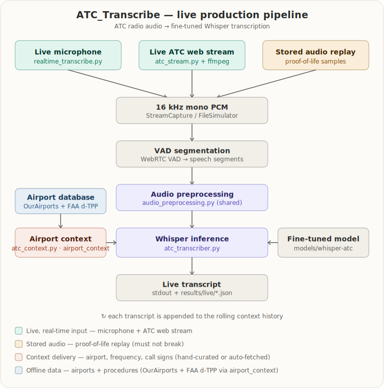

# Live ATC Transcription


Real-time transcription of live online ATC radio feeds using a fine-tuned Whisper model with **airport context** (facility, runways, fixes, and rolling call history).


Default feed: **KDFW Lone Star Approach (17/35C Final)** — 127.075 MHz.


## Pipeline



The system listens to ATC radio through one of three input modes — a live microphone feed (`realtime_transcribe.py`), a live ATC web stream (`atc_stream.py` + ffmpeg, orchestrated by `live_atc_pipeline.py`), or replay of a stored recording for proof-of-life tests — and routes all three through a shared front-end: 16 kHz PCM capture followed by WebRTC VAD segmentation. Each speech segment is cleaned by `audio_preprocessing.py`, given an airport-context prompt (`atc_context.py` + `airport_configs/*.json`), and transcribed by the fine-tuned Whisper model in `models/whisper-atc`. Completed transcripts feed back into the rolling context history.


## Quick start


**Windows (PowerShell):**


```powershell

# 1. Install

powershell -ExecutionPolicy Bypass -File scripts/install.ps1

.\.venv\Scripts\Activate.ps1


# 2. Install ffmpeg (required for live streams)

winget install Gyan.FFmpeg


# 3. Run

python live_atc_pipeline.py

```


**macOS / Linux (bash):**


```bash

# 1. Install (creates .venv, installs deps, downloads model weights)

bash scripts/install.sh

source .venv/bin/activate


# 2. Install ffmpeg (required for live streams)

brew install ffmpeg          # macOS  (Linux: sudo apt-get install ffmpeg)


# 3. Run

python live_atc_pipeline.py

```


On Apple Silicon (M-series) Macs, the default `device: "auto"` automatically uses the Metal (MPS) GPU. Override with `--device cpu` or `--device mps` if needed.


## Browser console (Web UI)

Run the transcriber on the host with the model (e.g. the Apple-Silicon Mac) and watch it from any browser on the same network — live transcript, a box to paste a LiveATC link, and handshake / proof-of-life status indicators.

```bash
pip install -r requirements-server.txt   # one-time: FastAPI + uvicorn
bash scripts/run_web_server.sh           # macOS / Linux  (Windows: scripts/run_web_server.ps1)
```

Then open the printed address (e.g. `http://<host-ip>:8000`) in a browser. See **[WEB_UI_README.md](WEB_UI_README.md)** for the full guide, the API, and how to update an existing Apple-Silicon install.


## Verify the install (proof of life)


After installing, run the diagnostic to confirm the model loads on this machine's GPU/CPU and transcribes correctly. It auto-detects CUDA (NVIDIA), Metal/MPS (Apple Silicon), or CPU, runs a few short bundled ATC snippets, and prints a PASS/FAIL verdict (exit code `0` on PASS).


```bash

# Cross-platform:

python diagnostics/diagnostic.py


# Or via the platform launcher:

bash diagnostics/diagnostic.sh                                        # macOS / Linux

powershell -ExecutionPolicy Bypass -File diagnostics/diagnostic.ps1   # Windows


# Force a backend, or save a JSON report:

python diagnostics/diagnostic.py --device cpu

python diagnostics/diagnostic.py --device mps --json report.json

```


The snippets and their reference transcripts live in `tests/diagnostic_data/`.


## How context works


Each transmission is decoded with a Whisper prompt built from:


1. **Static context** — facility name, airport, runways, fixes (from `airport_configs/kdfw.json`)

2. **Rolling history** — last 3 transcribed calls on the same feed


This biases the model toward correct ATC phraseology, call signs, and local names.


## Airport context pipeline (auto-fetched)


The hand-curated `airport_configs/*.json` above cover a couple of airports. The **`airport_context/`** package builds the same kind of context **automatically** for any U.S. airport from a local database (ingested offline from public-domain OurAirports data plus FAA d-TPP terminal procedures), adding spoken-form generation (`runway three zero left`, `Delta twelve thirty four`, `ILS or localizer runway three zero left`), frequency-specific ranking (clearance→SIDs, approach→approaches+STARs), candidate-callsign handling, and per-build snapshot logging.


```bash

python -m airport_context.cli ingest                                    # one-time: build the DB (airports/runways/freqs/navaids)

python -m airport_context.cli ingest-procedures                         # add FAA d-TPP approaches/SIDs/STARs

python -m airport_context.cli build --airport KMSP --frequency-type approach --callsigns DAL1234

```


It is wired into the live pipeline via `--airport`: pair any feed with an airport + frequency type, and the rolling transcript is fed back as prior-transcript context. Without `--airport`, the pipeline uses the hand-curated feed config exactly as before.


```bash

python live_atc_pipeline.py --stream-url https://d.liveatc.net/kdfw1_twr1_e --airport KDFW --frequency-type tower

```


No third-party dependencies (Python stdlib only). See **[airport_context/README.md](airport_context/README.md)**.


## Change the feed


Edit `airport_configs/kdfw.json` or pass flags:


```bash

python live_atc_pipeline.py --stream-url "https://d.liveatc.net/kdfw1_app_fin_17c"

python live_atc_pipeline.py --feed lone_star_approach_17l_final

```


Add new airports by creating `airport_configs/<icao>.json` with a `streams` section.


## Model


Fine-tuned Whisper-small weights are **not stored in this repo** (~922 MB). They are hosted on [Hugging Face Hub](https://huggingface.co/SingularityUS/ATC-whisper-v1) and **downloaded automatically** when you run `scripts/install.ps1`.


GitHub blocks files over 100 MB in git and ties release assets to Git LFS plan limits, so model weights are not published via GitHub Releases.


Manual download or troubleshooting: see `GITHUB.md` and `models/README.md`.


```powershell

python scripts/download_model.py          # download if missing

python scripts/download_model.py --check-only   # verify only

```


## Project layout


```

live_atc_pipeline.py   # Main entry point

atc_stream.py          # Live feed capture + VAD

atc_transcriber.py     # Fine-tuned Whisper inference

atc_context.py         # Airport + history context prompts

audio_preprocessing.py # Radio noise cleanup

airport_configs/       # Per-airport feed URLs and context (hand-curated)

airport_context/       # Auto-fetched airport context pipeline (see airport_context/README.md)

models/whisper-atc/    # Final fine-tuned model weights

config.yaml            # Default settings

server/                # Browser console (FastAPI + static UI) — see WEB_UI_README.md

scripts/               # install + run helpers

```


## Requirements


- Python 3.10+

- ffmpeg on PATH (live streams)

- GPU recommended (`--device cuda`)

- Model weights (~922 MB) — auto-downloaded on install; see `GITHUB.md` if download fails


See `LIVE_PIPELINE_README.md` and `GITHUB.md` for more details.


## Maintainer notes — code organization

The production pipeline (live inference + proof-of-life) and the model-training tooling currently live in the same directory. A future reorganization will move training code into a separate folder. Before doing that, note these dependencies that cross the production/training boundary (verified against the import graph):

- **`audio_preprocessing.py` is shared — do not move it.** It is imported by every live input mode (`atc_transcriber.py`, `realtime_transcribe.py`, `live_atc_transcribe.py`) and by `diagnostics/diagnostic.py`, as well as by training/eval (`evaluate_atco2.py`). Relocating it breaks both the live pipeline and the proof-of-life check. Keep it in the repo root.
- **`evaluate_atco2.py` is imported by `main.py`** (the `evaluate` subcommand) and by `evaluate_finetuned.py`. If it moves into a training folder, update `main.py`'s import and move `evaluate_finetuned.py` and `atc_normalization.py` alongside it (`atc_normalization.py` is imported only by `train_distil_whisper.py` and `evaluate_atco2.py`).
- **`airport_configs/` is referenced by relative path literals** in `live_atc_pipeline.py` (3 sites) and `main.py` (2 sites). If the configs move, update those literals and the examples above, or the default feed and the context prompt will fail to load.
- **Proof-of-life fixtures are not training data.** `tests/diagnostic_data/` (diagnostic snippets) and `data/live_atc/KJFK-Twr2-Mar-15-2026-0000Z.mp3` (replay sample) must stay where they are — the `scripts/*.bat` launchers and `diagnostics/diagnostic.py` reference them by fixed path.

Two minor issues were fixed directly: the misleading "Training-only scripts" label in `.gitignore` (it is a *local/untracked* list that also includes production files, not a purpose classification), and a dangling reference to a non-existent `evaluate_voxtral_val.py` in `scripts/run_atcosim_250.bat` (now disabled with a note).


## License


Model training data (ATCO2, ATCoSIM) is subject to its respective licenses and is **not** included in this repository.


