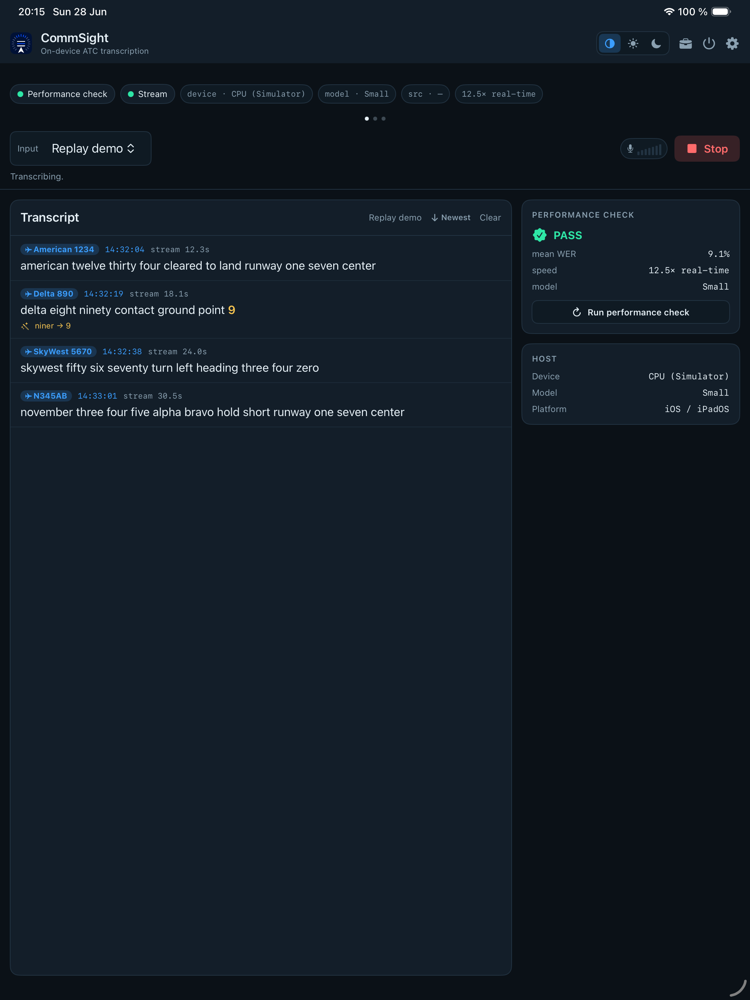
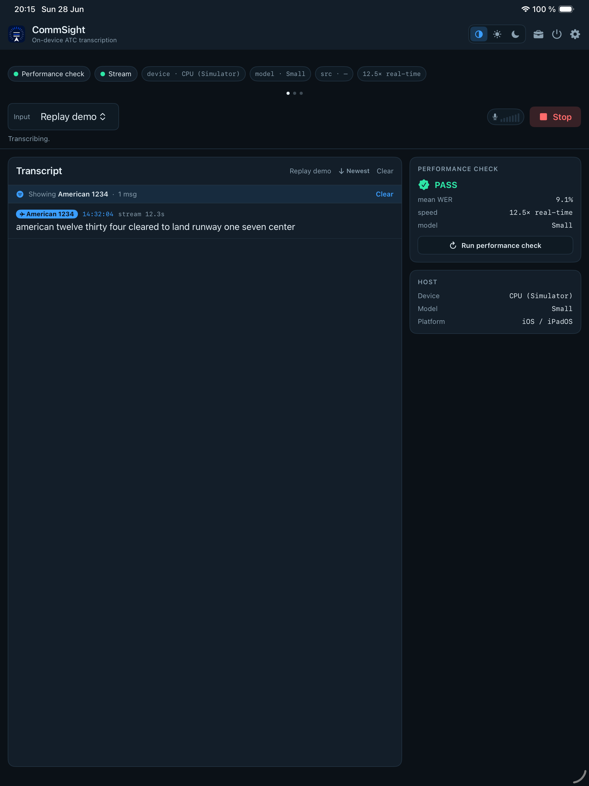
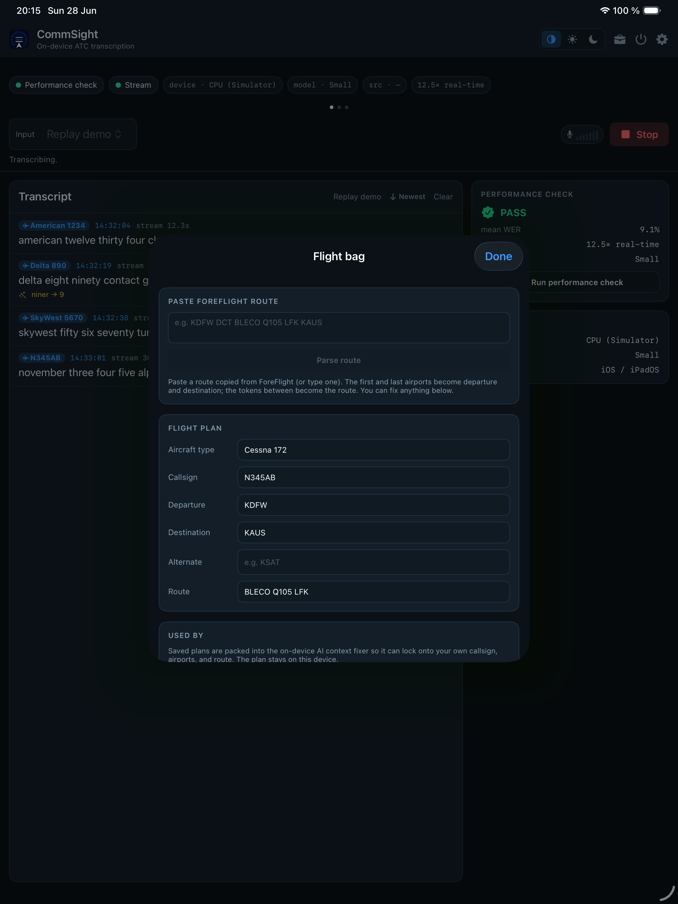
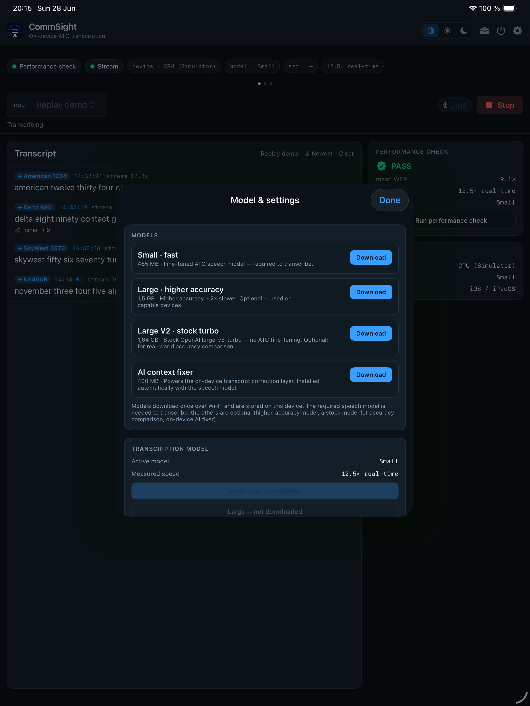
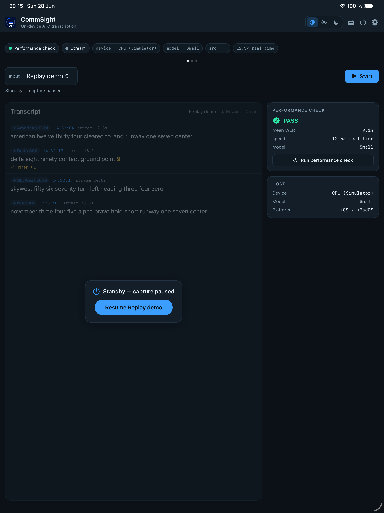

# CommSight — on-device ATC transcription for iPhone & iPad

A native Swift/SwiftUI port of the [ATC_Transcribe](../python-legacy/README.md) browser console.
Where the web console is a thin client talking to a Python host that runs the model, **CommSight
runs the entire pipeline on the device** — capture → squelch/VAD → preprocessing → airport &
context prompt → fine-tuned Whisper (CoreML / WhisperKit) → speaker diarization → two-tier
correction — with no server. Universal: one binary for iPhone and iPad (iPad-first cockpit/EFB
layout). Ships through TestFlight as **CommSight** (bundle `com.flycommsight.atctranscribe`).

> **Status: shipping on TestFlight (build 40 in prep; 39 live).** The whole pipeline runs on-device:
> the converted Whisper models transcribe on the Apple Neural Engine (~12.5× real-time on an M-class
> device), the LiveATC internet stream transcribes end-to-end, the optional two-tier correction layer
> refines each transmission (a fast deterministic pass plus a background RAG context-fixer LLM, on the
> CPU), live ADS-B traffic and a filed flight plan feed that corrector, callsigns are linked across a
> session, and speakers are labelled per line. The app is now a full cockpit EFB — a moving-map home
> screen with offline FAA charts, coded approaches/SIDs/STARs, and a voice-driven clearance loader
> (below). **438 unit tests + UI tests pass** on the iOS Simulator, and the engine + "performance
> check" run natively on the M4's real ANE. A 2026-07 whole-app audit (23 findings) was fully
> remediated + adversarially reviewed — see [`REMEDIATION.md`](REMEDIATION.md) and the Fragile
> Regions table in [`PIPELINES.md`](PIPELINES.md). The lean TestFlight build ships without the heavy
> models and downloads them on first launch.

This folder is self-contained and intended to split out into its own repository.

## Features

| Area | What it does |
| --- | --- |
| **Live sources** | Internet live feed (LiveATC / any stream URL), device microphone, USB audio, and an offline Replay demo. The feed can be monitored out the speakers to confirm it's arriving. |
| **On-device transcription** | Fine-tuned Whisper on the Apple Neural Engine via WhisperKit/CoreML. Three selectable models — **Small** (fast), **Large** (higher accuracy), **Large V2** (stock OpenAI turbo, for accuracy A/B). |
| **Two-tier correction** | A fast deterministic pass (spoken numbers, vocabulary/phonetic near-misses, repetition collapse) plus an optional background **AI context fixer** (on-device CPU LLM, or Apple Foundation Models) that fixes mis-heard callsigns/phraseology using retrieved ATC knowledge. On by default; every edit is shown `from → to`; the raw transcript is always kept. |
| **Live ADS-B traffic** | Streams aircraft within **30 NM** of the airport from a public feed so the corrector can lock a mis-heard callsign onto a plane actually on frequency. **Fresh-only** — stale contacts are dropped and never injected. Off by default (network + battery opt-in). |
| **Callsign linking** | Each transmission is tagged with its callsign; tap the chip to **filter the transcript to that one aircraft's conversation**. A green ✈ marks a callsign currently in range on the live ADS-B feed. |
| **Electronic Flight Bag** | File a ForeFlight-style flight plan (paste a route and it parses), shown as a colour-coded route; it's packed into the AI fixer's context so your own callsign/airports/waypoints are recognised. A plan over a week old is flagged stale. |
| **Moving-map home screen** | The app opens straight to an MKMapView chart with the live transcript, flight plan, and status as **draggable/resizable/pinnable floating cards** over it. Base layers switch between VFR sectional, IFR-low, standard, and satellite (offline-cached FAA charts — download by route or the whole lower-48), with Class B/C/D airspace, nearby navaids, and live traffic overlaid. **Tap any object** (airport/VOR/fix/airspace) to identify it; **search** by id or name; **long-press** to drop a waypoint; edit the route on the map. |
| **Coded procedures (CIFP)** | FAA coded **approaches, SIDs, and STARs** (from the bundled `cifp.sqlite`) draw as georeferenced overlays and load into the flight plan. They also **ground the corrector** — a heard procedure/fix is verified against what the airport actually publishes. |
| **Voice-driven clearance loader (EFB command interpreter)** | CommSight interprets a controller clearance addressed to **your own aircraft** — "N8925T, cleared direct BOSOX", "…cleared ILS runway 4 right", "…cleared via the SID/STAR" — and offers a **one-tap chip** to load it (direct-to a fix/airport, an approach for a runway, or a SID/STAR). Ownship-aware: it recognises your tail's ATC shorthands (`N8925T` / `8925T` / "Seneca 25T") but **never fires on another aircraft** mentioned on frequency, and never on a retracted/cancelled clearance. |
| **Speaker labelling** | Each line carries one fused **speaker label** — "ATC" (→ the addressed aircraft) for a controller transmission, the callsign for a pilot — from a content-role + acoustic-cluster fusion. |
| **Console UX** | Cockpit / Day / Night themes, a swipeable status·flight-plan·traffic notification carousel, a customizable sidebar (add/remove/reorder widgets), a one-tap low-power **standby**, **squelch** (auto noise-floor or manual), transcript sort + jump-to-newest, and a "performance check" self-test. All settings persist across launches. |
| **Model management** | Lean build downloads models on first launch with a progress gate; Settings → Models re-downloads on demand. The AI fixer installs automatically alongside the speech model. |

## Architecture (on-device pipeline)

Every stage from audio capture to corrected, attributed text runs **on the device** — the web
console's split design (a browser talking to a Python host over WebSocket) collapses into a single
app. Audio flows top to bottom; the Swift type is on the left, its `ATCTranscribe/` group in
parentheses:

```
   ┌─────────────────────────────────────────────────────────────────────┐
   │  iPhone / iPad   —   capture → corrected, attributed text, on-device  │
   └─────────────────────────────────────────────────────────────────────┘

   AudioSource  (Audio/)             internet feed · mic · USB · replay  → 16 kHz mono PCM
        │                            StreamAudioSource · DeviceAudioSource · ArrayAudioSource
        │                            (+ optional speaker monitor of the live feed)
        ▼
   VADSegmenter  (Audio/)            squelch (auto noise-floor / manual) → speech segments
        │
        ▼
   AudioPreprocessor  (Audio/)       radio band-pass + STFT spectral gate + normalize
        │
        ▼
   ATCContext  (Core/)               airport prompt · rolling history · RAG knowledge
        │                            + filed flight plan (EFB) + live ADS-B traffic (fresh-only)
        ▼
   ATCTranscriber  (Transcription/)  fine-tuned Whisper — Small / Large / Large V2 (WhisperKit/CoreML)
        │                            → Apple Neural Engine  → raw transcript + ASR confidence
        ▼
   Diarizer  (Audio/)                split a merged transmission into per-speaker lines
        │
        ▼
   ┌─ two-tier correction ─────────  transparent: raw always kept, every edit shown ───────────┐
   │   ▼  FAST inline  (in LivePipeline.process — instant, never blocks the feed)               │
   │  RepetitionCollapse → DeterministicCorrector    numbers · vocab/phonetic · repeats         │
   │   ▼  ConfidenceGate (Core/)   run the AI fixer only if a transmission looks suspicious      │
   │   ▼  SLOW background  (LLMRefiner · .background QoS · bounded queue · off the pipeline actor)│
   │  RAG retrieve (knowledge + flight plan + traffic) → AI fixer (llama.cpp CPU / Foundation)  │
   │  → CorrectionValidator guardrails               → record updated in place                  │
   └────────────────────────────────────────────────────────────────────────────────────────────┘
        │
        ▼
   CallsignExtractor  (Core/)        tag each line with its callsign → group / filter a conversation;
        │                            cross-reference the live ADS-B feed (in-range ✈ badge)
        ▼
   LivePipeline  (actor, Engine/)    drives the loop → TranscriptRecord (+ latency · speaker · callsign)
        │
        ▼
   TranscriptionSession → ConsoleView   (UI/ · SwiftUI: transcript with callsign chips + conversation
                                          filter, status/flight-plan/traffic carousel, customizable
                                          sidebar, themes, standby)
```

Concurrency: `AppModel` is the `@MainActor` view-model; `LivePipeline`, `ADSBService`, and
`ATCTranscriber` are `actor`s; the non-`Sendable` `ATCContext` is touched only by the pipeline
actor. UI changes hot-swap into a running session through a single seam (`AppModel →
TranscriptionSession.setX → Task { await pipeline.setX }`), so toggling correction, switching
models, or filing a flight plan never tears down the feed.

The same `LivePipeline` / corrector types run in the headless `ATCKitProbe` (native ANE) and in the
app, so the neural path is identical whether it's being tested or shipped.

## Screenshots (iPad Simulator)

Regenerated from the demo console by `Tools/screenshots.sh` (see
[Regenerating the screenshots](#regenerating-the-screenshots)) — no model or network needed.

The live console — brand + status carousel, the transcript with tappable **callsign chips** and
inline correction edits, and the customizable sidebar:

| Cockpit | Day | Night |
| --- | --- | --- |
|  |  |  |

Tap a callsign chip to **filter the transcript to that one aircraft's conversation** (left). The
**Electronic Flight Bag** files a ForeFlight-style plan that feeds the corrector (right):

| Callsign conversation filter | Electronic Flight Bag |
| --- | --- |
|  |  |

The **Model & settings** sheet (models manager + the two-tier correction controls) and the one-tap
low-power **standby**:

| Settings | Standby |
| --- | --- |
|  |  |

## Live ADS-B traffic

Optional (off by default). When enabled in **Settings → Live traffic** and a live session is
running, `ADSBService` polls [airplanes.live](https://airplanes.live)
(`GET /v2/point/{lat}/{lon}/30`, no auth, ~1 req/5 s) for aircraft within **30 NM** of the airport,
and feeds the in-range callsigns/N-numbers to the corrector so a mis-heard callsign can be locked
onto a plane actually on frequency. They also surface on the notification carousel's traffic page and
drive the green in-range ✈ badge on matching transcript callsigns.

The hard requirement is **stale data is never used**, enforced in layers:

- The **load-bearing gate is at the corrector read site** — `ATCContext` consumes the injected
  traffic block only while `Date() < expiry`, re-checked on every transmission, so a stalled /
  failed / backgrounded poller self-expires within a ~12 s trust window.
- `ADSBService` prunes contacts against a **server-anchored** clock (`lastSeen = fetchedAt −
  seen_pos`, never the poll time) after **every** poll, including failures, so a failed or empty poll
  never freezes old data on screen.
- Injection only happens while streaming is actually desired right now (`adsbActive` = streaming ON,
  a live session running, and the app foregrounded), so a late async callback after a toggle-off /
  standby / background **clears** rather than re-injects; an epoch counter discards in-flight updates
  after any clear.

Traffic feeds the LLM **prompt** but deliberately **not** the validator's snap-vocabulary, so the
fixer can't overwrite a spoken callsign ("american twelve thirty four") with the raw code form
("AAL1234") on a safety feed.

## Callsign linking & conversation filter

`CallsignExtractor` derives one canonical callsign per transmission — an airline form
("American 1234" → key `AAL1234`, via the telephony name + a flight-number token) or a GA tail
("November three four five alpha bravo" / a literal `N345AB`). It reuses the same telephony / ICAO
phonetic tables and number normalizer as the corrector. The canonical key groups an aircraft's
transmissions even across different phrasings (a split number read and a digit-by-digit read fuse to
the same key), so tapping a chip filters the transcript to that conversation, and a render-time check
against the fresh ADS-B set lights the green in-range ✈ exactly while the aircraft is on the feed.

## Correction pipeline

The correction layer is **output-only**: it runs on Whisper's decoded text, never touches the
rolling prompt history, and the raw transcript is always the source of truth. It is **on by default**
and **transparent** — every run returns a `Correction { raw, corrected, edits[] }` and the UI shows
each `from → to` edit inline with the backend that made it.

It runs in **two latency tiers** so a slow LLM can never stall transcription:

```
   raw Whisper transcript
        │
        ▼  FAST inline tier — in LivePipeline.process(), instant, always synchronous
   ┌──────────────────────────────────────────────────────────────────────────┐
   │  RepetitionCollapse   "runway three runway three" → "runway three"         │
   │  DeterministicCorrector  numbers ("niner"→9) · char near-miss              │
   │       (vocab) "maverik"→Maverick · phonetic "golf"→Gulf                    │
   │  CallsignSnap  snap-or-abstain vs fresh ADS-B traffic (falseCS 13.7→2%)    │
   │  SlotSnap      runway/frequency verified against the airport's REAL        │
   │       runways + published frequencies (AirportContextStore: curated       │
   │       config → bundled 29k-airport table → OurAirports internet fallback) │
   └──────────────────────────────────────────────────────────────────────────┘
        │  record emitted NOW (UI shows it immediately, marked "AI fixer running…")
        │  snap verdicts: gate signals · aircraft-attribution gating · LLM grounding
        ▼  SLOW background tier — LLMRefiner, .background QoS, bounded queue
   ┌──────────────────────────────────────────────────────────────────────────┐
   │  1. RAG retrieval (ATCKnowledgeRetriever) — the callsigns mentioned, this  │
   │     facility's spoken names, runways/fixes/taxiways, the right phraseology │
   │     + ICAO spelling, PLUS the filed flight plan and any fresh ADS-B        │
   │     traffic, lexically ranked out of ATCKnowledgeBase (Resources/          │
   │     knowledge/: airlines, overrides, phraseology).                         │
   │  2. The AI fixer (CPU llama.cpp, or Apple Foundation Models) →             │
   │     {corrected, edits} — fixes mis-heard callsigns/runways/navaids, ICAO   │
   │     phraseology, repeats, stray non-English; JSON via a ChatML few-shot.   │
   │  3. CorrectionValidator guardrails — applies ONLY safe edits: numbers      │
   │     preserved, `to` must be a known term or near-miss of `from`, no        │
   │     wholesale rewrite. Any failure → text unchanged.                       │
   └──────────────────────────────────────────────────────────────────────────┘
        │  record updated in place: "AI fixer running…" → refined text + edits
        ▼
   Correction { raw, corrected, edits[] : from → to · reason · backend · conf }
```

Decoupling is the key property: `process()` emits the record after the **fast** tier and hands the
text to `LLMRefiner` off the pipeline actor. The refiner runs one generation at a time at
`.background` priority; its queue is **bounded**, so under load (Whisper saturating the CPU) the
oldest pending refinement is dropped (`skipped`) rather than backing up — the context fixer uses
spare CPU and never slows the feed.

**Confidence gate (when to run the AI fixer).** Before the slow tier, a cheap deterministic
**Snap stages + LLM grounding (parity-ported from `python-legacy/`, see
`python-legacy/docs/PIPELINE.md` for diagrams, policies, and measured results).** `CallsignSnap`
(Core/) rewrites a misheard callsign only when it uniquely matches an aircraft actually on
frequency, and abstains otherwise; unverified callsigns still display as heard but are never
attributed to an aircraft. `SlotSnap` (Core/) verifies runway and frequency mentions against
`AirportContextStore` (Core/) — curated `airport_configs/`, then the bundled nationwide
`nav/airport_ctx.json` (29k airports worldwide, built by `Tools/build_airport_ctx.py` from the
same OurAirports upstream as the nav database), then an on-demand OurAirports internet fallback —
so it works at ANY real-life airport, including LiveATC/demo feeds where device sensors are
irrelevant. The snap verdicts also **augment the LLM tier**: a compact verified/unverified block
is appended to the RAG context (the model is told what it must not alter), `CorrectionValidator`
gains a grounding veto (the LLM can never introduce a runway that doesn't exist at the facility),
and unverified verdicts fire the gate below. Behavior parity with the Python reference is enforced
by `SnapParityTests` over `snap_fixtures.json` (regenerate with `Tools/gen_snap_fixtures.py`).

`ConfidenceGate` decides whether a transmission is even worth the LLM. It does *not* ask "are all
words known?" (that over-triggers on normal English chatter) — it runs the LLM only when a
**suspicion** signal fires: low Whisper `avgLogprob` or high `compressionRatio`, a lexical near-miss
to a known callsign/runway/fix, non-English, or residual repetition. Otherwise the record is marked
**"high confidence"** and the LLM is skipped, saving CPU/battery. A **Skip-when-confident** toggle +
**Conservative / Balanced / Aggressive** sensitivity live in **Settings → Transcript correction**
(default: on / on-device / Balanced). Skipping is safe — it only costs a missed refinement (the raw +
deterministic text always shows), never a wrong correction.

| Tier | Type | Needs | Runs |
| --- | --- | --- | --- |
| Fast (inline) | `RepetitionCollapse` + `DeterministicCorrector` (stdlib) | nothing | any device, instant, on the hot path |
| Slow · on-device LLM | `LocalLLMCorrector` → `LlamaContext` (llama.cpp) | the `llama.xcframework` + a GGUF (build/fetch steps below) | **CPU only** (`n_gpu_layers = 0`), background — leaves the ANE/GPU for Whisper |
| Slow · alternate | `FoundationModelsCorrector` | Apple Intelligence (iOS 26 / A17 Pro+/M-series) | runs on the ANE; pluggable behind the same `LLMCorrector` protocol |

The on-device AI fixer is a small CPU LLM that loads at most once per app run (cached, so a Whisper
model swap doesn't reload it) and degrades gracefully to vocabulary-only until its file finishes
downloading. Two one-time Mac steps enable the local backend (both git-ignored, so the repo stays
light):
```
bash Tools/build_llama_xcframework.sh   # vendors ios/Vendor/llama.xcframework (needs cmake)
bash Tools/fetch_llm_model.sh           # the GGUF (~0.4 GB) → Resources/Models/llm/
```
`LlamaContext` is behind `#if canImport(llama)`, so the app/probe build fine without the xcframework
(local LLM just unavailable). Grammar-constrained decoding is intentionally OFF: llama.cpp's GBNF
sampler raises an uncatchable C++ exception on a grammar-stack mismatch, so JSON is steered by the
few-shot prompt and recovered by the brace-scanning parser + validator instead. **Prompt-prefix
KV-cache reuse** evaluates the static system+few-shot block once and reuses it, cutting warm-path
latency to ~3.3 s on the M4 CPU (cold first call ~9.6 s) — fine for a background tier that refines
after the record is already on screen.

## Electronic Flight Bag

The briefcase in the top bar opens a ForeFlight-style editor (`FlightBagSheet`). Paste a route
("KDFW DCT BLECO Q105 LFK KAUS") and it parses into departure / destination / route; or fill the
aircraft type, callsign, departure, destination, alternate, and route fields by hand. The plan is
persisted (`UserDefaults` JSON) and packed into the correction context (`FlightPlan.contextBlock`,
reaching both LLM backends through `RetrievedContext.block`) so the fixer recognises your own
callsign, airports, and waypoints; its terms are added to the validator's allow-list so a near-miss
snaps back onto what you filed. The route is colour-coded on the carousel (airports purple-pink, VOR
green, RNAV/GPS fixes blue, airways amber), greyed until the AI context has downloaded. A plan older
than seven days is flagged stale on the briefcase and in the editor so it gets refiled before the
next flight.

## Models

The two fine-tuned checkpoints convert to WhisperKit CoreML format (see
`Tools/convert_to_coreml.md`, automated by `setup.sh --models`); the optional stock model needs no
conversion. UI names map to catalog entries (`Download/ModelCatalog.swift`):

| UI name | Entry | Source | Notes |
| --- | --- | --- | --- |
| **Small** | `small` (required) | HF fine-tuned weights + `openai/whisper-small` config/tokenizer¹ | ~465 MB. The model the app can't transcribe without; gates first-launch onboarding. |
| **Large** | `turbo` | HF `SingularityUS/…` fine-tuned turbo | ~1.5 GB. Higher accuracy, ~2× slower; used on capable devices. |
| **Large V2** | `cleanturbo` | `argmaxinc/whisperkit-coreml` (OpenAI large-v3-turbo) | ~1.64 GB. **Stock**, no ATC fine-tuning — for real-world accuracy A/B vs the fine-tuned Large. No conversion/upload needed. |
| **AI fixer** | `llm` | Qwen 0.5B-Instruct GGUF (q4) | ~0.4 GB. Powers the on-device correction LLM; installed automatically with the speech model. |

¹ The small HF repo ships only `model.safetensors` (no config/tokenizer), so `setup.sh`
reconstructs a complete model dir from the matching base.

Each Whisper folder holds `MelSpectrogram.mlmodelc`, `AudioEncoder.mlmodelc`,
`TextDecoder.mlmodelc`, the context-prefill data, and `config.json`. The app points WhisperKit's
`modelFolder` at one of these; **Settings → Transcription model** switches the active model at
runtime (Small / Large / Large V2) without tearing down the transcript.

### Runtime download (the shipping path) vs bundling

The TestFlight build ships **without** the heavy models and **downloads them on-device**, so the app
binary stays small. The download layer lives in [`ATCTranscribe/Download/`](ATCTranscribe/Download/):

- **First-launch gate** (`OnboardingDownloadView`) — if no Whisper model is present, the app gates on
  a download step with a progress bar and a green **"Model ready"** confirmation, then unlocks the
  console (or "Skip" to browse demo data). The optional Large / Large V2 models are offered here too.
- **Settings → Models** — a manager listing each model with a Download button → progress → **"Ready
  ✓"**, for on-demand downloads later. The AI fixer rides along with whichever speech model you
  download, so correction works regardless of which one you picked.
- Downloads land in **Application Support** (`ModelStore`) and are preferred over any bundled copy.
  The Whisper model uses WhisperKit's native HF download; the GGUF uses a `URLSession` task.

**One-time hosting prerequisite:** publish the converted WhisperKit models to an HF repo — see
**[`Tools/publish_models.md`](Tools/publish_models.md)**. The GGUF defaults to a public repo (no
hosting needed). Bundling still works for an offline build: drop a model under `Resources/Models/`
(or build with `REQUIRE_BUNDLED_MODEL=1`) and it takes over.

## How the Python modules map to Swift

| Python (repo root / `server/`) | Swift (`ATCTranscribe/`) | Status |
| --- | --- | --- |
| `atc_corrector.py` (deterministic) | `Core/ATCCorrector.swift`, `Core/StringRatio.swift`, `Core/RepetitionCollapse.swift` | ✅ corrects live in-app |
| `atc_corrector.OllamaCorrector` (local LLM) | `Core/LocalLLMCorrector.swift` + `Core/LlamaContext.swift` (llama.cpp, CPU) · `Core/FoundationModelsCorrector.swift` (alternate) | ✅ CPU-bound, RAG + guardrails + background refiner |
| `airport_context/` (phraseology, callsigns, overrides) | `Core/ATCKnowledgeBase.swift`, `Core/ATCKnowledgeRetriever.swift`, `Resources/knowledge/*.json` | ✅ RAG corpus + lexical retriever |
| `atc_context.py` | `Core/ATCContext.swift` | ✅ + flight-plan & ADS-B injection |
| `Correction`, `SpeechSegment`, `airport_configs/*.json` | `Models/*.swift` + `Resources/airport_configs/` | ✅ |
| `atc_stream.py` (VAD/segmentation) | `Audio/VADSegmenter.swift` | ✅ + squelch (auto/manual) |
| `atc_transcriber.py` (Whisper) | `Transcription/ATCTranscriber.swift` (WhisperKit) | ✅ runs on the ANE |
| `audio_preprocessing.py` | `Audio/AudioPreprocessor.swift` + `Biquad`/`STFT` | ✅ filters SciPy-parity |
| `server/engine.py` (model mgmt, adaptive) | `Engine/Engine.swift` (`TranscriberEngine`, `WER`) | ✅ engine + performance check (PASS on the ANE) |
| `live_atc_pipeline.py` + `server/session.py` | `Engine/LivePipeline.swift`, `Engine/TranscriptionSession.swift` | ✅ end-to-end on the ANE + LiveATC stream |
| `diagnostics/diagnostic.py` (proof-of-life) | `Engine/Engine.swift` + `ATCKitProbe` | ✅ runs natively on the ANE (probe) |
| `server/static/*` (browser UI) | `UI/` (Theme, ConsoleView, TranscriptView, SidebarView, SettingsSheet, FlightBagSheet, AppModel) | ✅ live console, themes, carousel, customizable sidebar |
| `atc_stream.py` capture / mounts | `Audio/` (AudioSource, StreamAudioSource, StreamURLResolver, AudioMonitor) | ✅ LiveATC stream verified end-to-end; mic/USB implemented |

**Native-only additions (no Python origin).** New to the iOS app:
`Aircraft/` (ADSBService, Aircraft, AirportCoordinates) — live ADS-B traffic; `Core/CallsignExtractor.swift`
— callsign linking + conversation filter; `Models/FlightPlan.swift` + `UI/FlightBagSheet.swift` —
the Electronic Flight Bag; `Audio/Diarizer.swift` — speaker diarization; `Download/` — runtime model
management; `UI/DeviceLoad.swift` — the diagnostics widget; plus standby, squelch, themes, and
settings persistence in `UI/AppModel.swift`.

Behavior parity with the Python deterministic core is cross-checked two ways: `Tools/parity_check.py`
runs the real Python modules against the exact cases the Swift XCTests assert, and the XCTests run
those cases on-device in the Simulator.

## Testing strategy — Simulator vs. native ANE

The iOS Simulator has **no Apple Neural Engine** (CoreML silently falls back to CPU), so it's the
wrong place to validate the neural path. Testing is split accordingly:

- **iOS Simulator** (`ATCTranscribe` scheme) — pure-logic XCTests (corrector, context, VAD, filters,
  WER, `CallsignExtractor`, `FlightPlan`, ADS-B decode/freshness, snap parity, EFB command parsing,
  ownship matching, the audit-remediation regression suites) + the `ConsoleUITests` that drive every
  control. **438 unit tests + UI tests**, headless via the Simulator. Deterministic-core behaviour is
  additionally **byte-parity-locked** to the Python reference (`SnapParityTests` + `Tools/parity_check.py`).
- **Native macOS, real ANE** (`ATCKitProbe`) — a command-line *probe* (not XCTest) that runs the
  engine + performance check on the Mac's actual Neural Engine: `bash Tools/probe.sh`. Measured
  **~12.5× real-time** on the M4 vs ~1× on the Simulator CPU.

A probe rather than a macOS XCTest target because macOS XCTest needs a GUI test-runner daemon
(`testmanagerd`) that isn't available over headless SSH — a plain executable runs anywhere.

## Quick start (fresh macOS / Apple Silicon)

Requires **full Xcode** installed (App Store / xip — too large to script). Then:

```bash
bash Tools/setup.sh          # uv+Python 3.11, whisperkittools, xcodegen, iOS sim runtime
bash Tools/setup.sh --models # + convert both Whisper models to CoreML (~30 min)
bash Tools/setup.sh --build  # + generate the Xcode project and compile it
bash Tools/setup.sh --all    # everything in one shot
```

`setup.sh` is idempotent and installs entirely into user space (no sudo).

## Building manually (what `setup.sh --build` runs)

```bash
~/.xcodegen/xcodegen/bin/xcodegen generate     # writes ATCTranscribe.xcodeproj (git-ignored)

# compile app + tests
xcodebuild -project ATCTranscribe.xcodeproj -scheme ATCTranscribe \
  -destination 'generic/platform=iOS Simulator' \
  -skipMacroValidation CODE_SIGNING_ALLOWED=NO build-for-testing

# run the unit + UI tests on a simulator
xcodebuild test-without-building -project ATCTranscribe.xcodeproj -scheme ATCTranscribe \
  -destination 'platform=iOS Simulator,name=iPhone 16'
```

For a real device, set `DEVELOPMENT_TEAM` (and a provisioning profile) in `project.yml` and use a
`platform=iOS,id=<udid>` destination.

## Shipping (TestFlight)

The headless build box (a Scaleway Apple-Silicon Mac) ships lean builds to TestFlight without a
display or a developer cert installed locally:

```bash
BUILD_NUMBER=<n> bash Tools/ship_testflight.sh   # archive unsigned → export App Store dist → upload
```

It builds an **unsigned** archive (skipping Development provisioning), then `-exportArchive` with the
App Store Connect API key creates the distribution profile + cloud cert and uploads — no devices, no
local private key. Models are moved aside so the build stays lean. The non-secret IDs, the exact
recipe, and the full rebuild-a-fresh-box runbook live in **[`RECOVERY.md`](RECOVERY.md)**. Bump
`BUILD_NUMBER` on every upload (App Store Connect rejects a reused build number).

## Why XcodeGen

`.xcodeproj` is a fragile generated bundle that can't be hand-edited reliably on Windows.
`project.yml` is the human-authored source of truth; `xcodegen generate` produces the `.xcodeproj` on
the Mac. The generated project is git-ignored.

## Regenerating the screenshots

The README screenshots are produced headlessly from the **demo console** (no model, no network) by a
gated UI test, so they never drift from the real UI:

```bash
bash Tools/screenshots.sh                       # default iPad Pro 13-inch (M5)
SIM="iPad Air 11-inch (M3)" bash Tools/screenshots.sh
```

It bakes `SCREENSHOTS=1` into the test scheme (via `xcodegen`), runs
`ATCTranscribeUITests/ScreenshotTests` on an iPad simulator, and exports the attached PNGs into
`docs/screenshots/`. The test `XCTSkip`s in the normal suite (the env var is empty there), so it
never flakes a ship.

## Preview the Simulator in a browser (headless Mac)

The build box has no display, so to *watch and tap* the app live — handy while an Apple developer
cert is pending, since the Simulator needs no signing — `Tools/preview.sh` streams the Mac's screen
to any browser over [noVNC](https://github.com/novnc/noVNC) and launches the app in the booted
Simulator. The chain is browser → SSH tunnel → websockify (`:6080`) → macOS Screen Sharing (`:5900`)
→ Simulator. Only `localhost:6080` is tunneled; nothing is exposed on the public IP.

One-time setup on the Mac:

```bash
git clone https://github.com/novnc/noVNC ~/noVNC      # the web VNC client (static files)
uv tool install websockify                            # the ws<->tcp proxy
bash Tools/preview.sh --enable-sharing                # turn on Screen Sharing (asks for sudo)
```

Each session:

```bash
bash Tools/preview.sh            # starts the noVNC proxy; launches the app on the live feed
#   add --replay to use the bundled demo clips instead of a LiveATC feed
```

Then from your machine:

```bash
ssh -i ~/.ssh/id_ed25519 -L 6080:localhost:6080 <user>@<host> -N   # leave running
# open http://localhost:6080/vnc.html  → VNC password (default atcprev8)
```

In the browser you first land on the macOS **login window** (the Mac boots headless with no session).
Log in to reach the desktop, then **re-run `bash Tools/preview.sh`** — the GUI steps (`open -a
Simulator`, surfacing the window) need a live Aqua session. Press **Start** in the app to transcribe;
live feeds are bursty (give it 30–60 s) or switch the input dropdown to **Replay demo** for instant
clips.

Low-lag tuning (full-desktop VNC of a headless Mac over the internet is heavy): `preview.sh` drops the
display to `1024x768`, bumps the cursor to 3×, and auto-hides the Dock (override with `PREVIEW_RES` /
`CURSOR_SIZE`; needs `brew install displayplacer`). On the client, open noVNC with
`?autoconnect=true&resize=scale&quality=4&compression=9&show_dot=true` to scale-to-fit, compress hard,
and show a cursor dot. Remaining input lag is mostly the datacenter round-trip (the box is in Paris).
