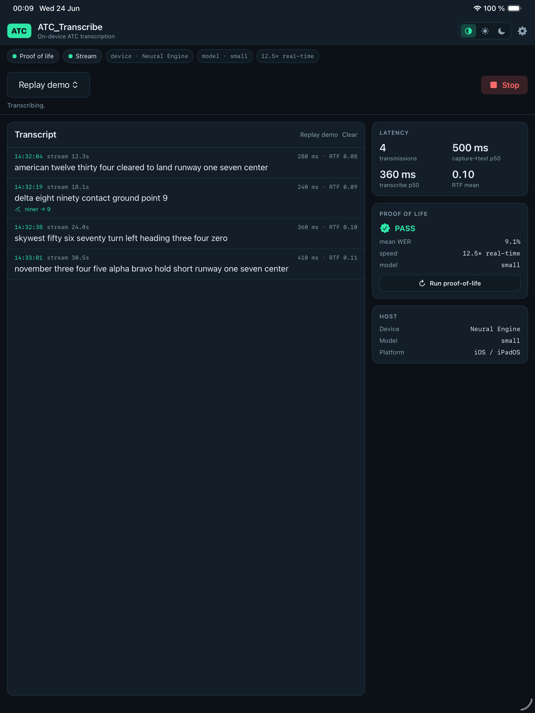
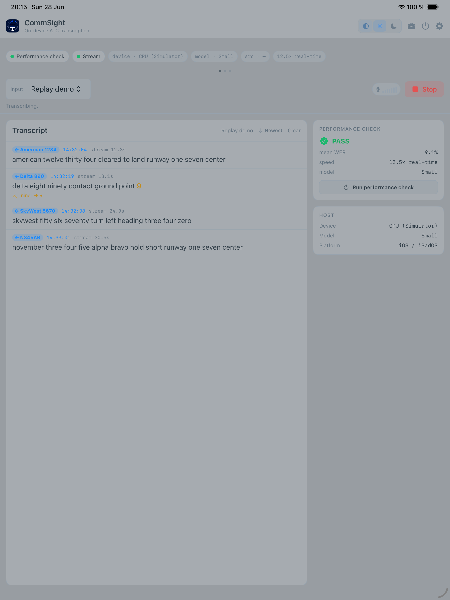
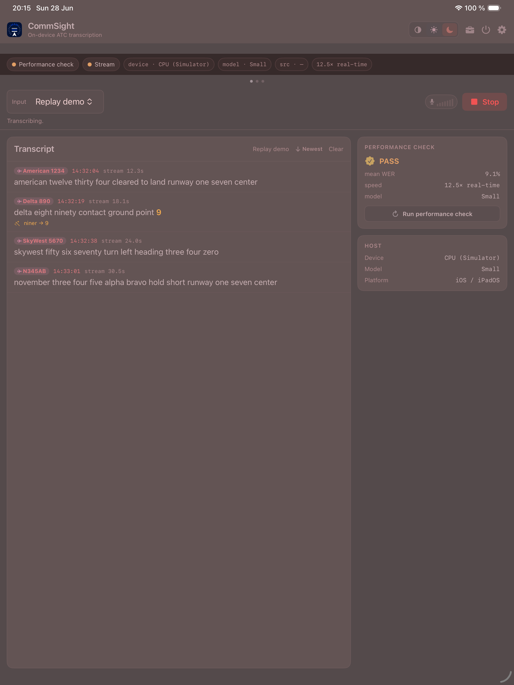
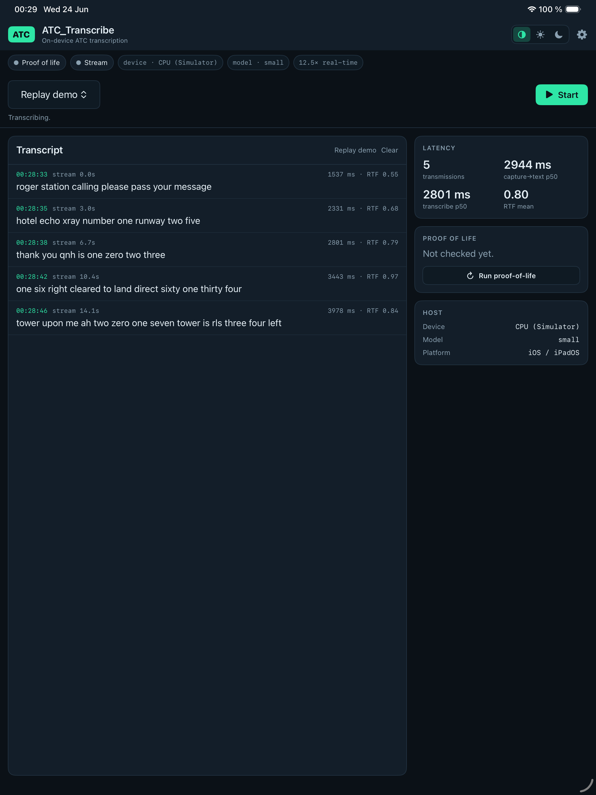
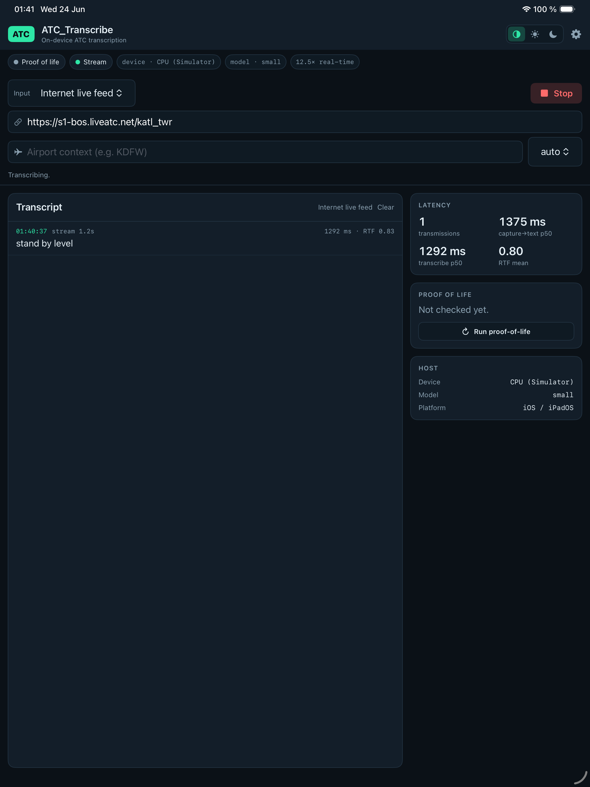
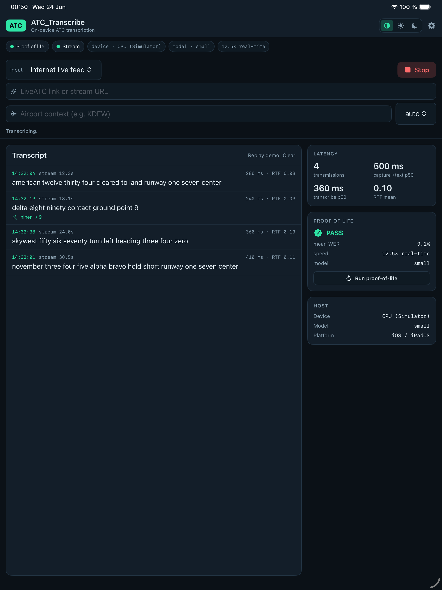
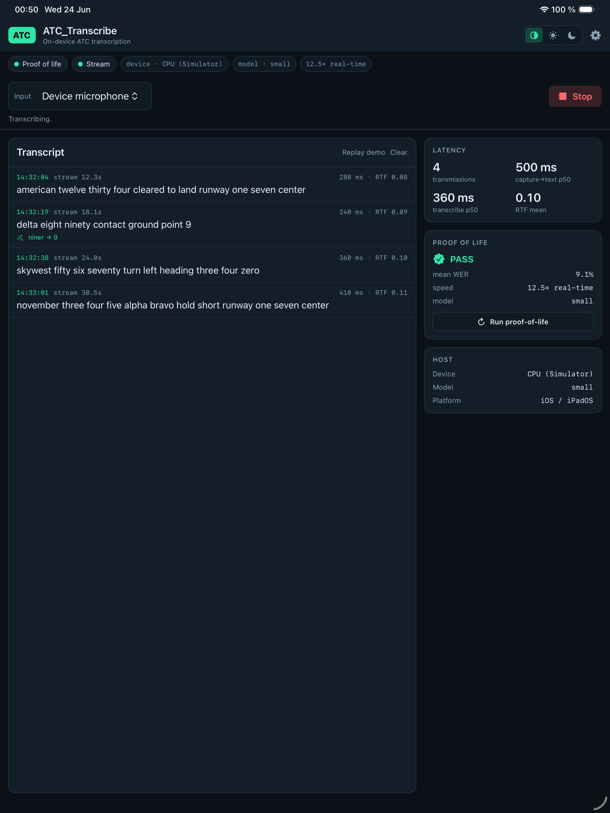
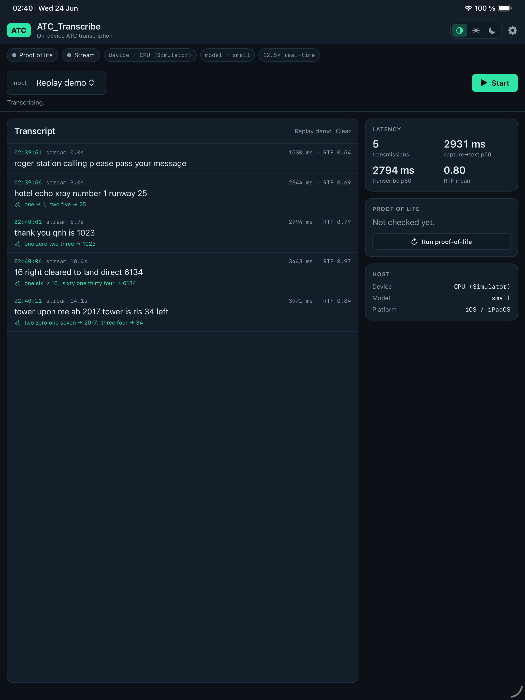

# ATC_Transcribe — iOS / iPadOS app (native, on-device)

A native Swift port of the [ATC_Transcribe](../python-legacy/README.md) browser console. Unlike
the web console (a thin client that talks to a Python host running the model), this
app runs the **entire pipeline on the device** — capture → VAD → preprocessing →
airport-context prompt → fine-tuned Whisper (CoreML/WhisperKit) → optional correction
— with no server. Universal: iPhone + iPad (iPad-first cockpit/EFB layout).

> **Status: the foundation builds, is tested, and the model runs on-device.** The
> scaffold, deterministic core (context + corrector), and VAD segmenter compile and
> pass a 20-test XCTest suite on the iOS Simulator, and `ATCTranscriber` loads the
> converted CoreML model and **transcribes the diagnostic ATC clips correctly**. Both
> fine-tuned models are converted to CoreML, and the **engine + proof-of-life run on the
> M4's real ANE** (12.5× real-time, mean WER 9.1%), and the **live session pipeline runs
> end-to-end** (file-replay → VAD → preprocess → context → transcribe → records, 5
> transmissions on the ANE), and the **SwiftUI console is wired to live transcription** —
> the replay demo transcribes in-app (Cockpit/Day/Night themes), and the **LiveATC live
> internet stream transcribes end-to-end** (AudioToolbox streaming MP3 decode → VAD →
> transcribe → UI, verified live on the KATL tower feed). An **optional on-device
> correction layer** then refines each transcript in two tiers: a fast inline
> vocabulary/number/repetition fixer (verified correcting live in-app), plus a **background
> RAG context-fixer LLM** — a bundled CPU **llama.cpp** model (Apple Foundation Models as a
> pluggable alternate) that fixes mis-heard callsigns, ICAO phraseology, repeats, and
> wrong-language leakage using retrieved ATC knowledge, behind output guardrails, decoupled
> so it never slows transcription. Remaining: on-device latency/quality tuning of the local
> LLM and on-device (mic / USB) testing — see the table below.

This folder is self-contained and intended to split out into its own repository.

## Architecture (on-device pipeline)

Every stage from audio capture to corrected text runs **on the device** — the web
console's split design (a browser talking to a Python host over WebSocket) collapses
into a single app. Audio flows top to bottom; the Swift type is on the left, its
`ATCTranscribe/` group in parentheses:

```
   ┌─────────────────────────────────────────────────────────────┐
   │  iPhone / iPad   —   capture → text, entirely on-device       │
   └─────────────────────────────────────────────────────────────┘

   AudioSource  (Audio/)             LiveATC stream · mic · USB · replay
        │                            StreamAudioSource·DeviceAudioSource·Array…
        ▼                            → 16 kHz mono PCM
   VADSegmenter  (Audio/)            split into speech segments (WebRTC / energy)
        │
        ▼
   AudioPreprocessor  (Audio/)       band-pass + STFT spectral gate + normalize
        │
        ▼
   ATCContext  (Core/)               airport prompt · rolling history · vocab()
        │
        ▼
   ATCTranscriber  (Transcription/)  fine-tuned Whisper (WhisperKit / CoreML)
        │                            → Apple Neural Engine · turbo ⇄ small (adaptive)
        ▼                            → raw transcript + ASR confidence (avgLogprob)
   ┌─ two-tier correction ─────────  transparent: raw always kept, every edit shown ─┐
   │    ▼  FAST inline  (in LivePipeline.process — instant, never blocks the feed)    │
   │  RepetitionCollapse → DeterministicCorrector    numbers · vocab/phonetic · repeats│
   │    │                                            → TranscriptRecord shown NOW      │
   │    ▼  ConfidenceGate (Core/)   run the LLM only if something looks suspicious —   │
   │    │     low avgLogprob · vocab near-miss · non-English · repetition; else SKIP   │
   │    ▼  SLOW background  (LLMRefiner · .background QoS · bounded queue · off-actor)  │
   │  RAG retrieve (ATCKnowledgeRetriever) → LLM (llama.cpp CPU / Foundation Models)   │
   │  → CorrectionValidator guardrails               → record updated in place         │
   └──────────────────────────────────────────────────────────────────────────────────┘
        │
        ▼
   LivePipeline  (actor, Engine/)    drives the loop · builds TranscriptRecord + latency
        │
        ▼
   TranscriptionSession → ConsoleView   (UI/ · SwiftUI: live records, themes, controls)
```

The correction layer is the substance of the on-device work; see **[Correction pipeline](#correction-pipeline)**
below for the full rationale (why it's two-tier, why the LLM is decoupled + CPU-only, why the
confidence gate exists, and how the guardrails keep it safe).

The same `LivePipeline` / `Corrector` types run in the headless `ATCKitProbe` (native
ANE) and in the app, so the neural path is identical whether it's being tested or shipped.

## Quick start (fresh macOS / Apple Silicon)

Requires **full Xcode** installed (App Store / xip — too large to script). Then:

```bash
bash Tools/setup.sh          # uv+Python 3.11, whisperkittools, xcodegen, iOS sim runtime
bash Tools/setup.sh --models # + convert both Whisper models to CoreML (~30 min)
bash Tools/setup.sh --build  # + generate the Xcode project and compile it
bash Tools/setup.sh --all    # everything in one shot
```

`setup.sh` is idempotent and installs entirely into user space (no sudo).

## Screenshots (iPad Simulator)

| Cockpit | Day | Night |
| --- | --- | --- |
|  |  |  |

The Replay demo transcribing **live in-app** (Simulator CPU — note the "CPU (Simulator)" badge
and ~2.8 s transcribe times vs ~0.2 s on a device's ANE):



The **LiveATC live internet stream** transcribing on-device — a real transmission ("stand
by level") captured from the KATL tower feed (`s1-bos.liveatc.net/katl_twr`), VAD-segmented
and transcribed (1.2 s clip, RTF 0.83 on the Simulator CPU), with auto-reconnect on the
feed's periodic drops:



Input method is a dropdown (Internet live feed / Device microphone / USB audio / Replay
demo). The LiveATC link + airport/frequency fields appear **only** for the internet live
feed (left) and are hidden for the microphone / USB inputs (right):

| Internet live feed | Device microphone |
| --- | --- |
|  |  |

The optional **correction layer** refining transcripts live — each edit is shown inline
(`from → to`) and the raw transcript is always preserved. The fast inline stage normalizes
spoken numbers (`one zero two three → 1023`) and collapses repetition; the background LLM
stage then fixes mis-heard callsigns, runway/waypoint names, ICAO phraseology, and
wrong-language leakage using retrieved ATC context (a record shows "refining…" then updates):



## How the Python modules map to Swift

| Python (repo root / `server/`) | Swift (`ATCTranscribe/`) | Status |
| --- | --- | --- |
| `atc_corrector.py` (deterministic) | `Core/ATCCorrector.swift`, `Core/StringRatio.swift`, `Core/RepetitionCollapse.swift` | ✅ builds, tests pass, corrects live in-app |
| `atc_corrector.OllamaCorrector` (local LLM) | `Core/LocalLLMCorrector.swift` + `Core/LlamaContext.swift` (llama.cpp, CPU) · `Core/FoundationModelsCorrector.swift` (alternate) | ✅ CPU-bound, RAG + guardrails + background refiner; llama.cpp interop verified on the Mac |
| `airport_context/` (phraseology, callsigns, overrides) | `Core/ATCKnowledgeBase.swift`, `Core/ATCKnowledgeRetriever.swift`, `Resources/knowledge/*.json` | ✅ ported as the RAG corpus + lexical retriever |
| `atc_context.py` | `Core/ATCContext.swift` | ✅ builds + tests pass |
| `Correction`, `SpeechSegment`, `airport_configs/*.json` | `Models/*.swift` + `Resources/airport_configs/` | ✅ builds + tests pass |
| `atc_stream.py` (VAD/segmentation) | `Audio/VADSegmenter.swift` | ✅ builds + tests pass (energy path) |
| `atc_transcriber.py` (Whisper) | `Transcription/ATCTranscriber.swift` (WhisperKit) | ✅ runs on-device — transcribes the diagnostic clips |
| `audio_preprocessing.py` | `Audio/AudioPreprocessor.swift` + `Biquad`/`STFT` | ✅ builds + tests pass (filters SciPy-parity; `noisereduce` deferred) |
| `server/engine.py` (model mgmt, adaptive) | `Engine/Engine.swift` (`TranscriberEngine`, `WER`) | ✅ engine + proof-of-life (PASS on the ANE, 12.5× real-time) |
| `live_atc_pipeline.py` + `server/session.py` | `Engine/LivePipeline.swift`, `TranscriptionSession.swift` | ✅ pipeline verified end-to-end on the ANE (5 transmissions) |
| `diagnostics/diagnostic.py` (proof-of-life) | `Engine/Engine.swift` + `ATCKitProbe` | ✅ runs natively on the ANE (probe) |
| `server/static/*` (browser UI) | `UI/` (Theme, ConsoleView, Transcript, Sidebar, Settings, AppModel) | ✅ console **wired to live transcription** — replay demo transcribes in-app (verified in the Simulator) |
| `atc_stream.py` capture / mounts | `Audio/` (AudioSource, StreamAudioSource, StreamURLResolver) | ✅ file-replay + **LiveATC live stream verified end-to-end** (AudioToolbox streaming MP3 decode + auto-reconnect); mic/USB implemented, device validation pending |

Behavior parity with the Python is cross-checked two ways: `Tools/parity_check.py`
runs the real Python modules against the exact cases the Swift XCTests assert, and the
XCTests then run those cases on-device in the Simulator.

## Correction pipeline

The correction layer is **output-only**: it runs on Whisper's decoded text, never touches
the rolling prompt history, and the raw transcript is always the source of truth. It is
**off by default** and **transparent** — every run returns a `Correction { raw, corrected,
edits[] }` and the UI shows each `from → to` edit inline with the backend that made it.

It runs in **two latency tiers** so a slow LLM can never stall transcription:

```
   raw Whisper transcript
        │
        ▼  FAST inline tier — in LivePipeline.process(), instant, always synchronous
   ┌──────────────────────────────────────────────────────────────────────────┐
   │  RepetitionCollapse   "runway three runway three" → "runway three"         │
   │  DeterministicCorrector  numbers ("niner"→9) · char near-miss              │
   │       (vocab) "maverik"→Maverick · phonetic "golf"→Gulf                    │
   └──────────────────────────────────────────────────────────────────────────┘
        │  record emitted NOW (UI shows it immediately, marked "refining…")
        ▼  SLOW background tier — LLMRefiner, .background QoS, bounded queue
   ┌──────────────────────────────────────────────────────────────────────────┐
   │  1. RAG retrieval (ATCKnowledgeRetriever) — pulls the callsigns mentioned, │
   │     this facility's spoken names, runways/fixes/taxiways, the right        │
   │     phraseology + ICAO spelling out of ATCKnowledgeBase (Resources/        │
   │     knowledge/: airlines, overrides, phraseology), lexically ranked.       │
   │  2. The LLM (CPU llama.cpp, or Apple Foundation Models) → {corrected,edits}│
   │     fixes mis-heard callsigns/runways/navaids, ICAO phraseology, repeats,  │
   │     stray non-English words — JSON steered by a ChatML few-shot prompt.    │
   │  3. CorrectionValidator guardrails — applies ONLY safe edits: numbers      │
   │     preserved, `to` must be a known term or near-miss of `from`, no        │
   │     wholesale rewrite. Any failure → text unchanged.                       │
   └──────────────────────────────────────────────────────────────────────────┘
        │  record updated in place: "refining…" → refined text + LLM edits
        ▼
   Correction { raw, corrected, edits[] : from → to · reason · backend · conf }
```

Decoupling is the key property: `process()` emits the record after the **fast** tier and
hands the text to `LLMRefiner` off the pipeline actor. The refiner runs one generation at a
time at `.background` priority; its queue is **bounded**, so under load (Whisper saturating
the CPU) the oldest pending refinement is dropped (`skipped`) rather than backing up — the
context fixer uses spare CPU and never slows the feed.

**Confidence gate (when to run the LLM).** Before the slow tier, a cheap deterministic
`ConfidenceGate` decides whether a transmission is even worth the LLM. It does *not* ask "are
all words known?" (that over-triggers on normal English chatter) — it runs the LLM only when a
**suspicion** signal fires: low Whisper `avgLogprob` or high `compressionRatio`, a lexical
near-miss to a known callsign/runway/fix (fuzzy ratio in `[floor, 0.84)` — close to a known term
but below the deterministic auto-fix bar), non-English, or residual repetition. Otherwise the
record is marked **"high confidence"** and the LLM is skipped, saving CPU/battery and keeping the
bounded queue free for transmissions that actually need help. A **Skip-when-confident** toggle +
**Conservative / Balanced / Aggressive** sensitivity live in **Settings → Transcript correction**.
Skipping is safe — it only costs a missed refinement (the raw + deterministic text always shows),
never a wrong correction. On the clean diagnostic clips the gate skips all five (`avgLogprob`
−0.01…−0.46, via the `ATCKitProbe` gate log); a noisy live feed's lower-confidence transmissions
trigger it.

| Tier | Type | Needs | Runs |
| --- | --- | --- | --- |
| Fast (inline) | `RepetitionCollapse` + `DeterministicCorrector` (stdlib) | nothing | any device, instant, on the hot path |
| Slow · on-device LLM | `LocalLLMCorrector` → `LlamaContext` (llama.cpp) | the `llama.xcframework` + a GGUF (build/fetch steps below) | **CPU only** (`n_gpu_layers = 0`), background — leaves the ANE/GPU for Whisper |
| Slow · alternate | `FoundationModelsCorrector` | Apple Intelligence (iOS 26 / A17 Pro+/M-series) | runs on the ANE; pluggable behind the same `LLMCorrector` protocol |

Two one-time Mac steps enable the local backend (both git-ignored, so the repo stays light):
```
bash Tools/build_llama_xcframework.sh   # vendors ios/Vendor/llama.xcframework (needs cmake)
bash Tools/fetch_llm_model.sh           # Qwen2.5-0.5B-Instruct Q4_K_M (~0.4 GB) → Resources/Models/llm/
```
`LlamaContext` is behind `#if canImport(llama)`, so the app/probe build fine without the
xcframework (local LLM just unavailable). Grammar-constrained decoding is intentionally OFF:
llama.cpp's GBNF sampler raises an uncatchable C++ exception on a grammar-stack mismatch, so
JSON is steered by the few-shot prompt and recovered by the brace-scanning parser + validator
instead. Pick the backend in **Settings → Transcript correction** (Off / On-device / Apple
Intel.), or launch headless with `--correct`, `--llm` (local), or `--llm-foundation`.

### Roadmap

**Now (shipped + verified on the M4).** Fast inline tier (repetition collapse + deterministic
numbers/vocab); RAG retrieval over the ported ATC knowledge base; CPU llama.cpp
`LocalLLMCorrector` (vendored `llama.xcframework`, modern API) + Apple Foundation Models as a
pluggable backend; output guardrails; decoupled background `LLMRefiner` with bounded
backpressure. **53 unit tests pass; the macOS probe LLM mode loads the GGUF on the CPU and
corrects a transcript** (e.g. `kenedy → kennedy`, numbers preserved, clean text untouched, no
crash). **Prompt-prefix KV-cache reuse** (`LlamaContext`) cuts per-transmission latency: the
static system+few-shot block (~490 tokens, identical every call) is evaluated once and reused,
so warm-path latency dropped from ~9.6 s to ~3.3 s on the M4 CPU (cold first call still ~9.6 s).
Fine for the background tier — the record shows immediately and refines later.

**Near-term.**
- **Further latency** — the ~3.3 s warm path is now mostly token generation; `n_threads` (vs
  Whisper contention), a smaller/faster quant, or a fine-tuned model needing no few-shot are the
  next levers.
- **On-device latency/quality numbers** — run the probe LLM mode on a real device and tune
  threads / queue depth / `minRefineWords` against live RTF (the headless M4 has no ANE, so
  the Whisper-RTF-under-refinement check is a device step).
- **Multi-word / n-gram vocab matching** in the deterministic stage (callsigns, multi-word
  fixes the per-token matcher misses).
- **Altitude / QNH-aware number assembly** — "nine thousand five hundred" → 9500.

**Later.**
- **ATC-specialized adapter (LoRA / fine-tuned GGUF)** on the local model for phraseology /
  callsigns — you already fine-tune Whisper on HF; same pipeline, a different base model.
- **Embedding-based retrieval** if the curated KB outgrows lexical ranking.
- **Operator-feedback loop** — accepted edits feed a local glossary biasing the Whisper
  prompt, the corrector vocab, and the RAG corpus.
- **Cross-transmission context** — resolve callsigns / runways consistently across a session.
- **Structured intent extraction** — emit `{callsign, instruction, runway, altitude,
  frequency}` for EFB integration, not just corrected text.

## Testing strategy — Simulator vs. native ANE

The iOS Simulator has **no Apple Neural Engine** (CoreML silently falls back to CPU), so
it's the wrong place to validate the neural path. Testing is split accordingly:

- **iOS Simulator** (`ATCTranscribe` scheme) — UI + pure-logic XCTests (corrector,
  context, VAD, filters, WER): 25 tests, fast, headless via the Simulator.
- **Native macOS, real ANE** (`ATCKitProbe`) — a command-line *probe* (not XCTest) that
  runs the engine + proof-of-life on the Mac's actual Neural Engine: `bash Tools/probe.sh`.
  Measured **12.5× real-time** on the M4 vs ~1× on the Simulator CPU.

A probe rather than a macOS XCTest target because macOS XCTest needs a GUI test-runner
daemon (`testmanagerd`) that isn't available over headless SSH — a plain executable runs
anywhere.

## Models

The two fine-tuned checkpoints convert to WhisperKit CoreML format (see
`Tools/convert_to_coreml.md`, automated by `setup.sh --models`):

| App model | Source | Output folder (contains the `.mlmodelc` set) |
| --- | --- | --- |
| `turbo` | HF `SingularityUS/ATC-whisper-turbo-v1` | `$OUT_DIR/turbo/<sanitized-id>/` (~1.5 GB) |
| `small` | HF weights + `openai/whisper-small` config/tokenizer¹ | `$OUT_DIR/small/<sanitized-id>/` (~465 MB) |

¹ The small HF repo ships only `model.safetensors` (no config/tokenizer), so `setup.sh`
reconstructs a complete model dir from the matching base. Permanent fix: upload
`config.json` + tokenizer to the small repo, then convert it directly.

Each folder holds `MelSpectrogram.mlmodelc`, `AudioEncoder.mlmodelc`,
`TextDecoder.mlmodelc`, the context-prefill data, and `config.json`. The app points
WhisperKit's `modelFolder` at one of these (the engine picks turbo vs small by device
capability, mirroring the web console's adaptive downgrade). The exact subfolder name
is the sanitized model id — locate it with `find $OUT_DIR -name AudioEncoder.mlmodelc`.

## Building manually (what `setup.sh --build` runs)

```bash
~/.xcodegen/xcodegen/bin/xcodegen generate     # writes ATCTranscribe.xcodeproj (git-ignored)

# compile app + tests
xcodebuild -project ATCTranscribe.xcodeproj -scheme ATCTranscribe \
  -destination 'generic/platform=iOS Simulator' \
  -skipMacroValidation CODE_SIGNING_ALLOWED=NO build-for-testing

# run the unit tests on a simulator
xcodebuild test-without-building -project ATCTranscribe.xcodeproj -scheme ATCTranscribe \
  -destination 'platform=iOS Simulator,name=iPhone 16'
```

For a real device, set `DEVELOPMENT_TEAM` (and a provisioning profile) in `project.yml`
and use a `platform=iOS,id=<udid>` destination.

## Why XcodeGen

`.xcodeproj` is a fragile generated bundle that can't be hand-edited reliably on
Windows. `project.yml` is the human-authored source of truth; `xcodegen generate`
produces the `.xcodeproj` on the Mac. The generated project is git-ignored.

## Preview the Simulator in a browser (headless Mac)

The build box has no display, so to *watch and tap* the app live — handy while an Apple
developer cert is pending, since the Simulator needs no signing — `Tools/preview.sh`
streams the Mac's screen to any browser over [noVNC](https://github.com/novnc/noVNC) and
launches the app in the booted Simulator. The chain is browser → SSH tunnel → websockify
(`:6080`) → macOS Screen Sharing (`:5900`) → Simulator. Only `localhost:6080` is tunneled;
nothing is exposed on the public IP.

One-time setup on the Mac:

```bash
git clone https://github.com/novnc/noVNC ~/noVNC      # the web VNC client (static files)
uv tool install websockify                            # the ws<->tcp proxy
bash Tools/preview.sh --enable-sharing                # turn on Screen Sharing (asks for sudo)
```

Each session:

```bash
bash Tools/preview.sh            # starts the noVNC proxy; launches the app on the live feed
#   add --replay to use the bundled demo clips instead of a LiveATC feed
```

Then from your machine:

```bash
ssh -i ~/.ssh/id_ed25519 -L 6080:localhost:6080 <user>@<host> -N   # leave running
# open http://localhost:6080/vnc.html  → VNC password (default atcprev8)
```

In the browser you first land on the macOS **login window** (the Mac boots headless with no
session). Log in to reach the desktop, then **re-run `bash Tools/preview.sh`** — the GUI
steps (`open -a Simulator`, surfacing the window) need a live Aqua session, which only
exists once a user is logged in. Press **Start** in the app to transcribe; live feeds are
bursty (give it 30–60 s) or switch the input dropdown to **Replay demo** for instant clips.

Gotchas on a fresh headless box: the Screen Sharing VNC socket is launchd
socket-activated, so it won't show in `lsof` until first connect — check with `netstat -an
| grep 5900`. `screencapture`/`launchctl asuser` from SSH can't grab another audit
session's display (`could not create image from display`), but `xcrun simctl io booted
screenshot` captures the Simulator framebuffer directly and works headless. To skip the
manual desktop login each boot, enable auto-login for the user (FileVault must be off).

Low-lag tuning (full-desktop VNC of a headless Mac over the internet is heavy): `preview.sh`
drops the display to `1024x768`, bumps the cursor to 3×, and auto-hides the Dock (override
with `PREVIEW_RES` / `CURSOR_SIZE`; needs `brew install displayplacer`). On the client,
open noVNC with `?autoconnect=true&resize=scale&quality=4&compression=9&show_dot=true` to
scale-to-fit, compress hard, and show a cursor dot. Remaining input lag is mostly the
datacenter round-trip (the box is in Paris) and can't be tuned away. A fully interactive
**device-only** stream (just the iPhone/iPad screen) would need a tap bridge — `idb` has no
working companion on macOS 26, so the route is WebDriverAgent/Appium; not built here.
