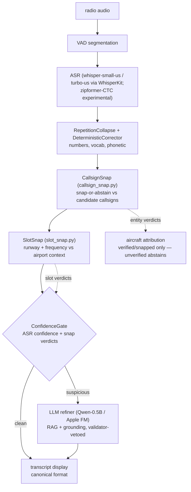
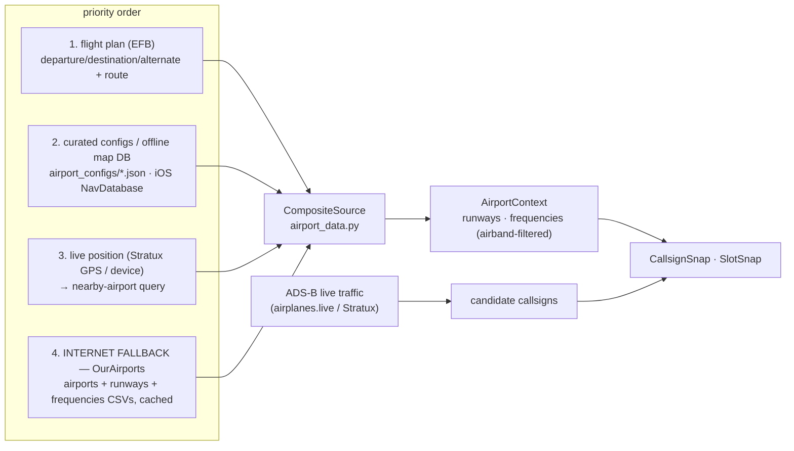

# Correction pipeline & context providers

The post-ASR correction chain and where its grounding data comes from. Python
is the reference implementation (this folder); the iOS app mirrors each stage
in Swift with parity fixtures. Metrics for every stage live in
[RESULTS.md](RESULTS.md); every stage must not regress canonWER on the gold set.

## The pipeline

Two output channels, deliberately different:

* **TEXT** — a snap stage rewrites the transcript only on a confident, unique
  match; anything unverified stays exactly as heard (display honesty).
* **ENTITY/VERDICTS** — `verified / snapped / unverified / invalid` per
  callsign and slot. Only verified/snapped callsigns are attributed to
  aircraft; verdicts also feed the confidence gate and (future) UI flags.
  This is where the safety wins live (falseCS 13.7% → 2.0% on gold).

## Context provider chain (what grounds the snaps)

Rules of the chain:

* Curated/local data wins per field; the internet fallback fills gaps and is
  the ONLY source in **LiveATC / demo mode** (a remote feed has nothing to do
  with the device's sensors — the feed's airport ident drives the lookup).
* The fallback is OurAirports (public domain, no API key, ~17 MB cached CSVs,
  worldwide) — the same upstream the iOS offline nav DB is built from
  (`ios/Tools/build_nav_db.py`), so both platforms share one source of truth.
* ARTCC feeds (ZAN/ZFW/…) resolve to a context with no runways/frequencies;
  snap stages become verdict-only no-ops there by design.

## Stage policies (safety invariants)

| stage | may rewrite text when | never |
|---|---|---|
| CallsignSnap | unique candidate within edit 2 (telephony) / 1 (digits) | invents a callsign; touches text on ambiguity |
| SlotSnap runway | unique same-suffix designator within digit-edit 1 | adds/changes L-C-R suffix; snaps across suffixes |
| SlotSnap frequency | unique published airband freq within digit-edit 1, anchored by contact/tower/… | edits un-anchored numbers; uses out-of-airband candidates |
| LLM refiner | validator-approved edits only | overrides snap verdicts; introduces ontology violations |

## Measured findings that shaped this design (gold v0)

1. Callsign failure is a **digit** problem — airline words survive; snap +
   abstain cuts false attribution to 2.0% for every architecture tested.
2. Models emit wrong-but-**legal** slot values, never impossible ones — a
   static ontology veto catches nothing; grounding must be contextual.
3. Gold's wrong runways are wrong-but-REAL runways (heard 22, truth 31, both
   exist) — existence-grounding verifies but cannot fix; the next lever is
   **activity context** (runway encoded in the approach feed name, ATIS,
   cross-transmission consistency). Queued as future work.

## Known deficiencies (queued)

* iOS offline nav DB (`nav_coords.json`) has **no runway or frequency data**;
  only 2 curated airport configs ship (KDFW, KJFK). → extend
  `build_nav_db.py` + add a Swift `AirportDataSource` with the OurAirports
  internet fallback (reuse the `ADSBService` fetcher pattern).
* No source for **ARTCC (center) frequencies**; navaid frequencies and
  SID/STAR procedures are not modeled anywhere.
* Abbreviated frequency speech ("ground point seven five" = 121.75) is not
  yet completed against the facility's published set.
* Runway **activity** prior (approach-feed runway / ATIS) not yet consumed.
